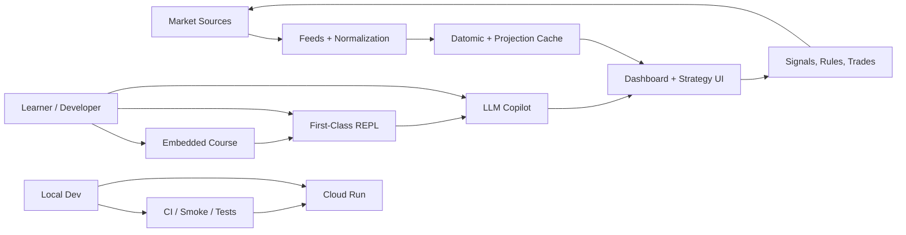
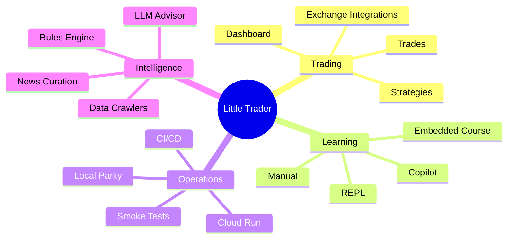
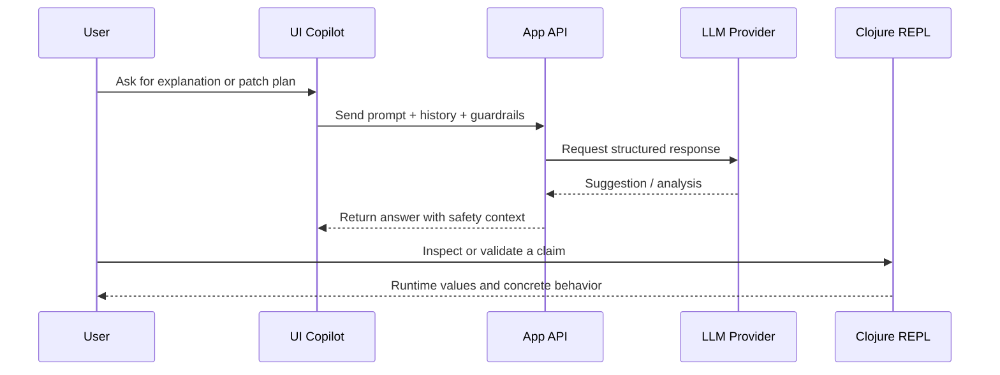
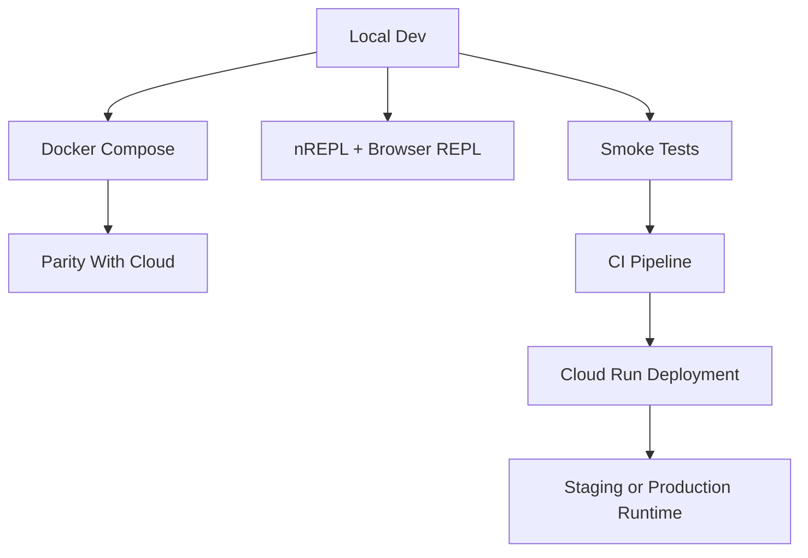

# Architecture Visual Guide

This guide explains Little Trader through visual slices rather than a single abstract diagram. The goal is to make the runtime, the learning surfaces, and the developer augmentation story easy to explain to a new contributor.

## Navigation

- [Developer Onboarding Playbook](./DEVELOPER_ONBOARDING_PLAYBOOK.md)
- [Embedded Course and Manual](./EMBEDDED_COURSE_AND_MANUAL.md)
- [Course Curriculum](./COURSE_CURRICULUM.md)
- [C4 Architecture](./C4_ARCHITECTURE.md)
- [News and Data Crawlers](./NEWS_AND_DATA_CRAWLERS.md)

## System Shape

Little Trader has three coordinated loops:

- The trading loop: data in, signals out, execution and reporting
- The learning loop: embedded course, REPL, and copilot
- The delivery loop: local parity, CI, and Cloud Run deployment

## Runtime Layers

### 1. Presentation

- Trading dashboard
- Strategy editor
- Discrete rules page
- Learn studio
- Chat and REPL helpers

### 2. Application

- Pathom resolvers
- Auth and session handling
- Rule evaluation
- LLM advisor flows

### 3. Data

- Datomic as the source of truth
- Pulsar as the stream and projection layer
- Exchange snapshots and crawler normalization

### 4. Augmentation

- MCP dual REPL access
- In-app copilot prompts
- Embedded course content
- CI smoke and parity checks

## Feature Map

## Copilot Loop

## Deployment Parity

## How To Read The Architecture

- If you want to understand user-facing behavior, start with the dashboard and copilot loop.
- If you want to understand data correctness, start with the feeds and Datomic layer.
- If you want to understand how to change the system safely, start with the REPL, smoke tests, and deployment parity.

## Operational Guardrails

- Conceptual diagrams do not imply production wiring unless the code path exists.
- If a feature is described here but not in code, mark it as planned or optional.
- Prefer one diagram per concern instead of one large diagram with everything in it.
- Keep the local and cloud paths as similar as possible before adding new runtime behavior.

