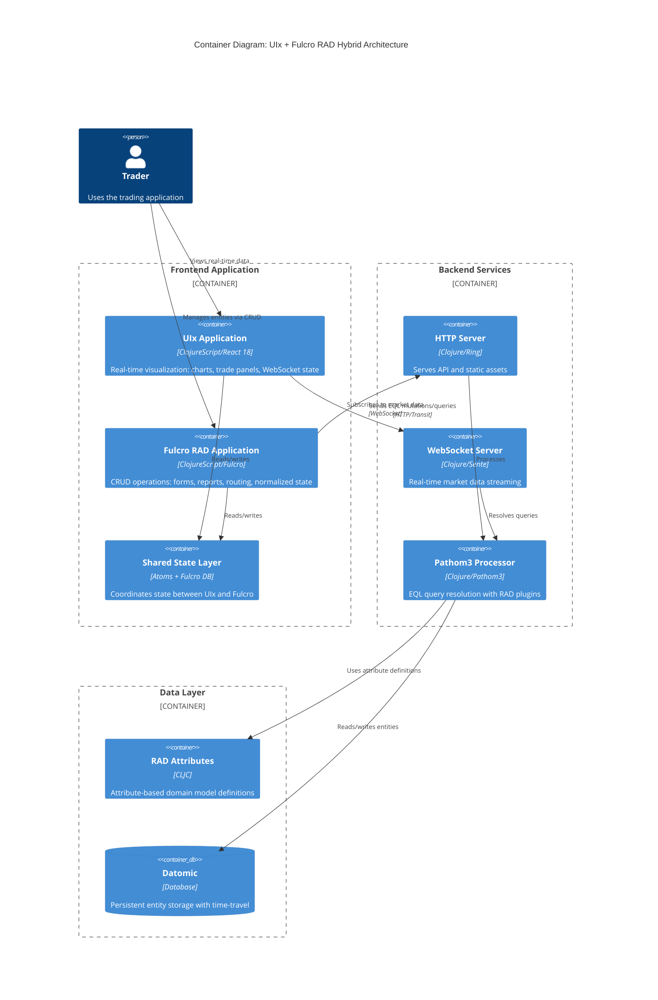
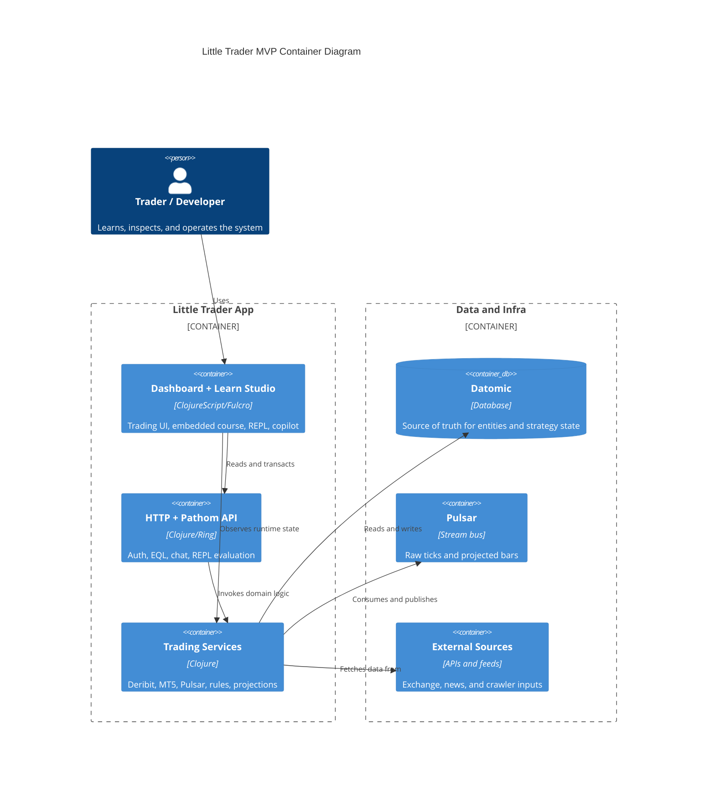
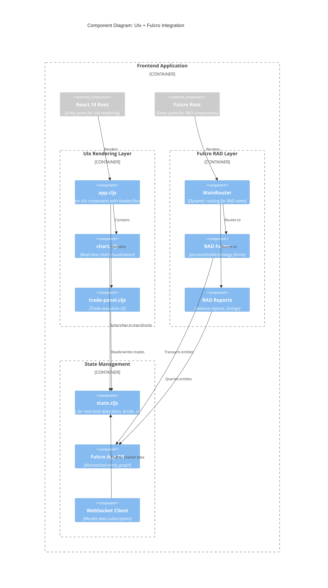
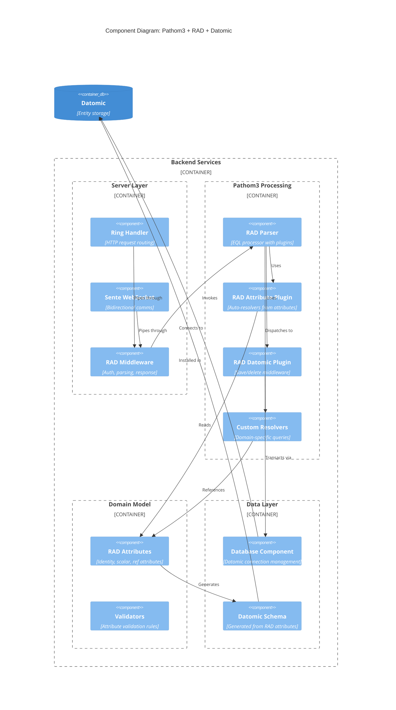
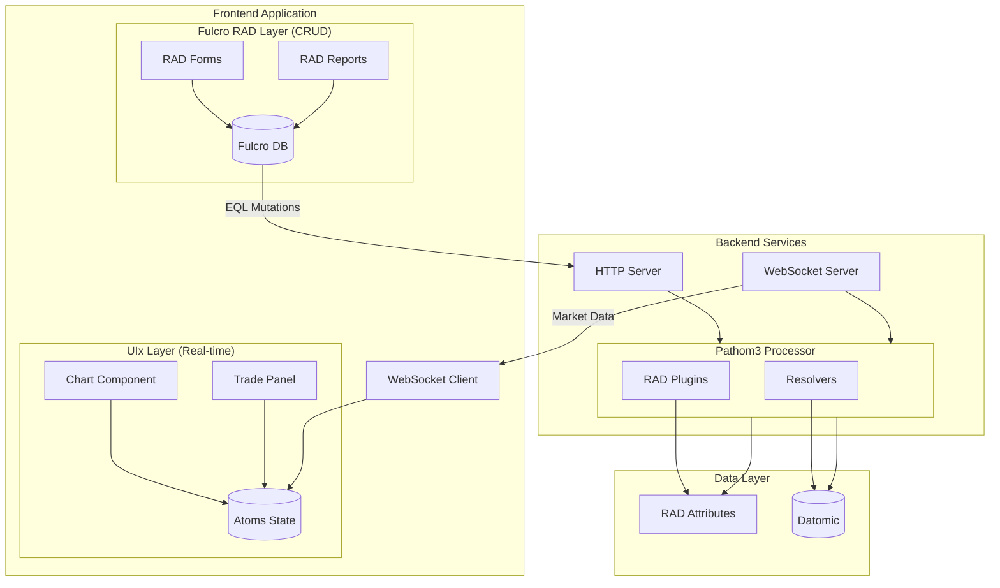
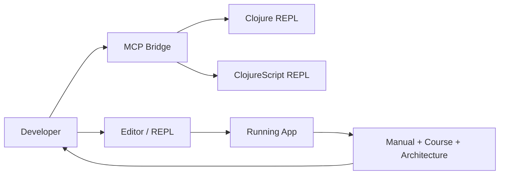

# C4 Architecture: UIx + Fulcro RAD Hybrid

This document describes the architectural integration of UIx (modern React) with Fulcro RAD for the Little Trader application.

## Navigation

- [Embedded Course and Manual](/Users/victorinacio/4coders/little-trader/docs/EMBEDDED_COURSE_AND_MANUAL.md)
- [Architecture Visual Guide](/Users/victorinacio/4coders/little-trader/docs/ARCHITECTURE_VISUAL_GUIDE.md)
- [News and Data Crawlers](/Users/victorinacio/4coders/little-trader/docs/NEWS_AND_DATA_CRAWLERS.md)

## Scope

This diagram set focuses on the current MVP slice:

- Fulcro RAD UI and in-app learning surfaces
- Pathom/EQL and backend routing
- Datomic, Pulsar, and exchange integrations
- Developer augmentation through REPL and MCP

## Container Diagram

## MVP Container Diagram

## Component Diagram: Frontend Integration

## Component Diagram: Backend Processing

## Data Flow Diagram

## Key Integration Points

1. **Dual Entry Points**: Both UIx (`app.cljs`) and Fulcro (`client.cljs`) have separate React roots
2. **State Isolation**: UIx uses atoms for real-time data; Fulcro uses normalized DB for entities
3. **Shared Backend**: Both frontends communicate through the same Pathom3 processor
4. **Attribute-Centric**: RAD attributes define schema, validation, and auto-resolvers
5. **Real-time vs CRUD**: UIx handles streaming data; Fulcro handles entity management

## Developer Augmentation View

The augmentation loop is intentional:

- The app teaches the system.
- The REPL verifies assumptions.
- MCP gives the assistant structured access.
- Docs explain the trust boundaries and workflow.
