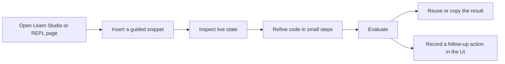

# Clojure REPL First Class

Little Trader treats the REPL as a primary product surface, not a sidecar debugging tool. The goal is to make the loop fast enough that the first thing you do is inspect live state, not guess at it.

## What "First Class" Means

- The app includes an in-product REPL page at `src/com/little_trader/ui/repl.cljs`.
- The backend exposes `/api/repl/eval`, but only when the server is explicitly configured for it.
- The workflow is optimized for small, reversible expressions with guided snippets, history, and copy/reuse actions.
- The REPL is designed for exploration, not privileged administration. Destructive actions should live in explicit UI flows or guarded backend paths.

## Runtime Guardrails

The current implementation uses three layers of protection:

- `APP_ENV=production` or `APP_ENV=prod` disables the eval surface.
- `REPL_EVAL_ENABLED=true` is required outside production-like environments.
- The authenticated user must have an admin role.

That means the REPL is safe to keep visible in the app while still being operationally constrained.

## Daily Workflow



Typical flow:

1. Start the app locally with `clj -M:dev`.
2. Open the REPL page in the UI.
3. Insert a snippet from the guided palette.
4. Edit it, run it, and use history to iterate.
5. Keep the command small enough that you can explain why it exists.

## Useful Commands

- `clj -M:dev` starts the backend REPL and the HTTP app in development.
- `npm run dev` starts the browser build and the frontend runtime.
- `npx shadow-cljs cljs-repl app` opens a browser REPL for frontend evaluation.
- `bash ./scripts/ci-api-smoke.sh` verifies the REPL-adjacent app surfaces still behave correctly.

## Good REPL Habits

- Prefer read-only queries first.
- Reach for `count`, `keys`, `get-in`, and `select-keys` before mutating anything.
- Build and validate one expression at a time.
- Use the local history to compare previous attempts instead of retyping them.
- Keep snippets reusable and explicit so they can be pasted into docs or tests later.

## Example Probes

```clojure
@com.little-trader.ui.state/app-state

(count (:bars @com.little-trader.ui.state/app-state))

(-> @com.little-trader.ui.state/app-state :signals last)
```

## Where To Look Next

- UI workflow: [ui/repl.cljs](/Users/victorinacio/4coders/little-trader/src/com/little_trader/ui/repl.cljs)
- Developer ergonomics: [docs/DEVELOPER_ERGONOMICS.md](/Users/victorinacio/4coders/little-trader/docs/DEVELOPER_ERGONOMICS.md)
- Cloud setup: [docs/CLOUD_RUN_SETUP.md](/Users/victorinacio/4coders/little-trader/docs/CLOUD_RUN_SETUP.md)
- MCP details: [MCP_DEVELOPMENT.md](/Users/victorinacio/4coders/little-trader/MCP_DEVELOPMENT.md)

