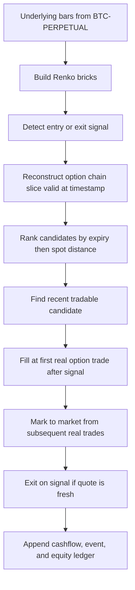
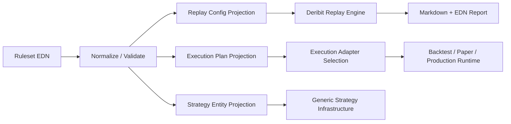

# Deribit Near-Expiry Options Strategy Manual

## Purpose

This document is the deep technical manual for the current Deribit BTC near-expiry options strategy implemented in this repository.

It is written for a reader who needs all of the following at once:

- the business intuition behind the strategy
- the exact code paths that express the strategy
- the operational workflow for replay, testing, paper trading, and guarded live rollout
- the main optimization levers
- the failure modes, debugging steps, and practical fixes

The scope of this manual is the current "near-expiry common" strategy stack centered on:

- [`src/com/little_trader/domain/options_signals.clj`](../src/com/little_trader/domain/options_signals.clj)
- [`src/com/little_trader/domain/options_strategy_pack.clj`](../src/com/little_trader/domain/options_strategy_pack.clj)
- [`src/com/little_trader/domain/options_ruleset.clj`](../src/com/little_trader/domain/options_ruleset.clj)
- [`src/com/little_trader/domain/deribit_options_replay.clj`](../src/com/little_trader/domain/deribit_options_replay.clj)
- [`src/com/little_trader/components/strategy_resolvers.clj`](../src/com/little_trader/components/strategy_resolvers.clj)
- [`src/com/little_trader/ui/strategy_editor.cljs`](../src/com/little_trader/ui/strategy_editor.cljs)
- [`src/com/little_trader/domain/strategy_executor.clj`](../src/com/little_trader/domain/strategy_executor.clj)
- [`resources/strategy-rulesets/deribit-btc-near-expiry-common.edn`](../resources/strategy-rulesets/deribit-btc-near-expiry-common.edn)

As of `2026-03-30`, this is the most complete path in the codebase for a deterministic, Deribit-backed, options-specific replay with editable rulesets and an explicit transition path toward paper and live execution.

---

## Strategy in One Page

The strategy is a long-option, single-leg, short-duration BTC system.

It does **not** short premium. It buys either:

- a near-expiry call when the BTC underlying shows a bullish reversal or bullish momentum on Renko bricks
- a near-expiry put when the BTC underlying shows a bearish reversal or bearish momentum on Renko bricks

The underlying signal is generated from `BTC-PERPETUAL`, but the traded instrument is a listed Deribit BTC option selected from the currently valid chain slice around the signal timestamp.

The current template is:

- pack id: `:renko-near-expiry-common`
- underlying: `BTC-PERPETUAL`
- resolution: `15`
- brick size: `35.0`
- entry mode: `:hybrid`
- DTE window: `1` to `4`
- capital fraction per entry: `0.18`
- profit target: `+18%`
- stop loss: `-12%`
- time exit: `<= 1` DTE

The operating idea is simple:

1. Use Renko bricks on the underlying to remove some intraday noise.
2. Focus on short-dated options because gamma is high and premium reacts quickly.
3. Buy only one option position at a time.
4. Keep risk defined by premium paid.
5. Use deterministic replay logic so the historical run is explainable bar by bar and tick by tick.

This is a **convexity capture** strategy, not a carry strategy and not a volatility-selling strategy.

---

## Business Logic and Economic Thesis

### What the strategy is trying to monetize

The business thesis is that short-dated BTC options can reprice much faster than the underlying when BTC starts moving with intent. That repricing is strongest when:

- the option is close enough to expiration to have high gamma
- the selected strike is not too far from spot
- the market is actually trading the contract, so price discovery is real
- the directional move is large enough to overcome theta and fees

The system is trying to buy that convexity only when the underlying gives a structured directional clue.

### Why use the underlying instead of the option for signals

The underlying is used for signal generation because:

- option prices are noisier and can become sparse
- liquidity is fragmented across strikes and expiries
- the underlying prints continuously and gives a stable directional state
- Renko bricks on the underlying are easier to reason about than option microstructure alone

The option is treated as the **execution vehicle** and the underlying as the **decision engine**.

### Why near-expiry options

Near-expiry options are chosen because:

- they move fast when spot moves
- they can provide large percentage premium changes from modest underlying moves
- they allow smaller notional tickets than some longer-dated alternatives
- they are a natural fit for short-duration Renko entries

The cost is equally important:

- theta decay accelerates
- liquidity can be uneven
- stale or missing trade prints can make some otherwise valid signals unexecutable
- false breakouts become expensive quickly

### Why the strategy is "common"

"Common" here means the strategy is deliberately simple:

- no spreads
- no skew-arb logic
- no delta hedging
- no volatility surface forecasting layer
- no dynamic multi-leg order construction

That simplicity is intentional. It keeps the ledger explainable and makes the execution path easier to validate.

---

## Where the Real Edge Comes From

The strongest gains are expected when all of the following line up:

1. BTC is moving enough to print meaningful `35`-point Renko bricks on the `15` minute underlying series.
2. The move happens inside a liquid `1-4` DTE window.
3. The selected option is close enough to spot that a spot move translates into option premium acceleration.
4. IV is not so extreme that you are massively overpaying for optionality.
5. Trade prints remain fresh, so the replay or runtime can actually fill at a believable price.

This means the best regime is usually:

- a genuine breakout with follow-through
- a sharp exhaustion pattern that quickly reverses
- a volatility expansion that happens after entry, not before entry

The weakest regime is usually:

- slow drift that cannot overcome theta
- chop smaller than the brick size
- late, overextended entries into already-expanded IV
- thin chains where the signal exists but executable prints do not

The strategy is therefore highly sensitive to **realized move relative to time decay**.

---

## Instrument, Pricing, and Accounting Model

### Trading instrument

The current strategy targets Deribit BTC options while reading the underlying from `BTC-PERPETUAL`.

### Premium denomination

Deribit BTC option premiums are quoted in BTC terms. The replay ledger, however, is maintained in USDT-equivalent cash and equity. The conversion path is:

`option premium in BTC * index price in USDT * quantity`

This is visible in the replay helpers:

- `option-notional-usdt`
- `fee-usdt`
- `build-entry-size`
- `position-value-usdt`
- `unrealized-pnl-usdt`

in [`src/com/little_trader/domain/deribit_options_replay.clj`](../src/com/little_trader/domain/deribit_options_replay.clj).

### Position sizing

The strategy uses a fixed capital fraction:

- default initial capital: `1000.0` USDT
- default fraction per trade: `0.18`

That means an entry tries to spend at most `18%` of current free cash on premium plus fees.

Important details:

- quantity is rounded down to the instrument minimum trade amount
- the replay refuses the trade if quantity is zero after quantization
- the replay also refuses the trade if gross premium plus fee would exceed cash

### Cashflow model

The replay is explicit about cash movement:

- `:deposit` creates the day-01 starting capital
- `:entry-order` reduces cash by premium plus fee
- `:mark-to-market` does not change cash, only equity
- `:exit-order` increases cash by net proceeds

The report contains:

- `:cashflows`
- `:events`
- `:equity-curve`

That is the core of the "long-running cashflow" explanation. The system is not merely generating signals; it is walking the entire life of the trade ledger.

---

## The Canonical Ruleset

The editable template lives at:

- [`resources/strategy-rulesets/deribit-btc-near-expiry-common.edn`](../resources/strategy-rulesets/deribit-btc-near-expiry-common.edn)

The same structure is defined programmatically in:

- [`src/com/little_trader/domain/options_ruleset.clj`](../src/com/little_trader/domain/options_ruleset.clj)

### Template

```clojure
{:template-id :btc-near-expiry-common
 :name "BTC Near Expiry Common"
 :pack-id :renko-near-expiry-common
 :currency "BTC"
 :underlying-instrument "BTC-PERPETUAL"
 :resolution "15"
 :days-back 7
 :brick-size 35.0
 :signal-config {:entry-mode :hybrid
                 :trend-brick-count 2
                 :min-delta 0.20
                 :max-delta 0.80
                 :max-iv-percentile 0.95
                 :min-dte 1
                 :max-dte 4
                 :profit-target-pct 0.18
                 :stop-loss-pct -0.12
                 :time-exit-dte 1}
 :capital {:initial-usdt 1000.0
           :capital-fraction 0.18}
 :replay {:quote-lookback-hours 6
          :execution-lookahead-hours 18
          :max-chain-candidates 14
          :candidate-sort :expiry-then-spot}
 :execution {:mode :backtest
             :order-type :market
             :slippage-tolerance 0.0015
             :testnet? true}}
```

### Meaning of each field

| Field | Meaning | Why it matters |
| --- | --- | --- |
| `:pack-id` | Chooses the pack family | Selects a default signal profile and replay defaults |
| `:resolution` | Underlying bar interval | Controls noise level and signal frequency |
| `:brick-size` | Renko brick threshold on underlying | Main frequency / sensitivity lever |
| `:entry-mode` | `:reversal`, `:trend`, or `:hybrid` | Changes when entries can fire |
| `:trend-brick-count` | Minimum consecutive bricks for trend entries | Higher values reduce noise but lower frequency |
| `:min-dte` / `:max-dte` | Expiry window | Core near-expiry constraint |
| `:profit-target-pct` | Exit target | Smaller target raises turnover, lowers per-trade expectancy ceiling |
| `:stop-loss-pct` | Max tolerated premium loss | Defines risk budget per trade |
| `:time-exit-dte` | Exit when expiry gets too close | Avoids the final theta cliff |
| `:capital-fraction` | Cash fraction deployable per trade | Main account-level risk control |
| `:quote-lookback-hours` | How far back a quote can be considered for candidate selection | Too small drops fills, too large risks stale execution |
| `:execution-lookahead-hours` | How long to wait after the signal for the first actual trade print | Too small misses fills, too large becomes unrealistic |
| `:max-chain-candidates` | Number of nearest chain candidates examined | Larger values increase fill odds but may drift away from "common" contracts |
| `:candidate-sort` | Candidate ranking policy | Controls whether nearest expiry or nearest strike dominates |
| `:execution.mode` | `:backtest`, `:paper`, or `:production` | Determines execution adapter planning |

### Three representations of the same strategy

The current system intentionally maintains three representations:

1. **Ruleset EDN**
   The human-editable, canonical template.

2. **Generated strategy entity**
   A portable strategy map used by the generic strategy stack.

3. **Replay config / execution plan**
   Derived operational views used by deterministic replay and runtime mode preview.

This is implemented in [`src/com/little_trader/domain/options_ruleset.clj`](../src/com/little_trader/domain/options_ruleset.clj) through:

- `normalize-ruleset`
- `validate-ruleset`
- `ruleset->strategy`
- `ruleset->replay-config`
- `ruleset->execution-plan`

This split is powerful because it keeps editing simple, but it also means a technical reader should always ask:

> "Which representation is actually driving this workflow?"

For the current near-expiry path:

- the ruleset EDN is the editing source of truth
- the replay config drives deterministic historical replay
- the execution plan drives adapter choice and operational intent
- the generated strategy entity is a portability and integration layer for the existing strategy infrastructure

---

## Signal Logic in Detail

The primary signal engine lives in:

- [`src/com/little_trader/domain/options_signals.clj`](../src/com/little_trader/domain/options_signals.clj)

### Entry logic

There are two entry families:

#### 1. Reversal entries

For calls:

- look for Renko directions `[-1 -1 1]`
- interpret that as bearish exhaustion and bullish reversal
- emit `:buy-call-swing`

For puts:

- look for Renko directions `[1 1 -1]`
- interpret that as bullish exhaustion and bearish reversal
- emit `:buy-put-swing`

#### 2. Trend-following entries

For calls:

- require an uptrend of at least `trend-brick-count`
- emit `:buy-call-trend`

For puts:

- require a downtrend of at least `trend-brick-count`
- emit `:buy-put-trend`

#### 3. Hybrid entry mode

The near-expiry template uses `:hybrid`, which means:

1. try reversal detection first
2. if there is no reversal entry, try trend-following detection

This is important. `:hybrid` is not "blend the scores" and it is not "need both". It is "reversal first, trend fallback".

### Exit logic

Exit logic also lives in [`src/com/little_trader/domain/options_signals.clj`](../src/com/little_trader/domain/options_signals.clj), in `detect-options-exit-signal`.

Priority order is:

1. profit target
2. stop loss
3. time exit near expiry
4. pattern reversal against the held position

That priority matters because if two conditions are true at the same time, the earliest matching condition wins.

### Current signal knobs that are active

The following knobs are actively used in replay and signal evaluation:

- `:entry-mode`
- `:trend-brick-count`
- `:min-dte`
- `:max-dte`
- `:profit-target-pct`
- `:stop-loss-pct`
- `:time-exit-dte`

### Current signal knobs with limited historical effect

Two important constraints exist in the current deterministic replay:

1. Historical chain reconstruction is built from instrument metadata, not full historical option snapshots.
2. The replay does not currently compute historical delta or IV percentile for each candidate chain slice.

As a result:

- `:min-delta`
- `:max-delta`
- `:max-iv-percentile`

are part of the ruleset schema and part of the intended strategy design, but in the current replay path they usually do **not** bind as strongly as they would in a richer live or ticker-enriched evaluation path, because missing values are allowed to pass.

This is not hidden. It is a current implementation boundary.

### One more nuance: generated rules vs canonical runtime behavior

`ruleset->strategy` synthesizes a set of generic rules for portability and inspection. That is useful for the broader strategy system, but the canonical options behavior still lives in the dedicated options signal engine and replay runtime.

In other words:

- the generated rules are a useful projection
- the options runtime is the authoritative behavior for this strategy family

This distinction matters when debugging why a saved strategy looks one way in a generic rules preview but behaves according to `options_signals.clj` in replay.

---

## Pack Layer and Why It Exists

The pack registry lives in:

- [`src/com/little_trader/domain/options_strategy_pack.clj`](../src/com/little_trader/domain/options_strategy_pack.clj)

It defines named presets such as:

- `:renko-swing-weekly`
- `:renko-trend-biweekly`
- `:renko-hybrid-monthly`
- `:renko-near-expiry-common`

The pack layer is useful for three reasons:

1. It gives the system a stable identifier for a strategic family.
2. It keeps default resolution, lookback, and brick settings centralized.
3. It makes comparative replay easier across strategy styles.

The near-expiry pack is configured as:

- market style: `:short-duration`
- resolution: `15`
- days-back: `7`
- brick size: `35.0`
- quote lookback: `6` hours
- execution lookahead: `18` hours
- max chain candidates: `14`
- candidate sort: `:expiry-then-spot`

The `:expiry-then-spot` sorting is a big design choice. It means the system first prefers the nearest acceptable expiry and only then prefers the closest strike to spot. That increases the chance of staying inside the "near-expiry" thesis.

---

## Deterministic Replay: What It Does and Why It Matters

The replay engine lives in:

- [`src/com/little_trader/domain/deribit_options_replay.clj`](../src/com/little_trader/domain/deribit_options_replay.clj)

This namespace is the clearest expression of the strategy as an executable historical narrative.

### Data sources used

The replay uses real Deribit public production data for:

- underlying bars via TradingView chart data
- DVOL series
- active and expired option instrument metadata
- option trade ticks for fill and mark-to-market decisions

### Why this is called deterministic

It is deterministic because:

- the initial deposit is explicit
- the chain reconstruction policy is explicit
- candidate ranking is explicit
- the fill rule is explicit
- position sizing is explicit
- fees are explicit
- the event ledger is explicit

Nothing is hand-waved as "and then the trade happened".

### What the replay is not

It is **not** a full market microstructure simulator.

Specifically:

- it does not replay the historical full order book
- it does not model queue position
- it does not model bid/ask spread path at each millisecond
- it does not store full historical option chain snapshots from the public API because Deribit does not expose them publicly

So this replay is much stronger than a toy backtest, but weaker than a true exchange-grade execution simulator.

### End-to-end flow



### Replay algorithm in plain English

For every underlying bar:

1. Generate any new Renko bricks.
2. If a position is open:
   - advance through any option trades up to the current bar timestamp
   - update last known premium and equity
   - test exit conditions
   - if an exit is triggered and the quote is fresh enough, close the position
3. If no position is open:
   - reconstruct the eligible option chain for the timestamp
   - detect a call or put signal on the underlying
   - search for a tradable candidate with a recent real trade
   - fill at the first real option trade after the signal
4. Append a point to the equity curve.

### Freshness rules

There are two freshness windows that heavily affect executability:

- `quote-lookback-hours`
- `execution-lookahead-hours`

They mean different things:

- lookback says how old the candidate's last observed trade is allowed to be when validating that the contract is actually trading
- lookahead says how long the engine is allowed to wait after the signal for the first post-signal execution print

These are major optimization levers, but they are also realism levers. If they are too loose, replay becomes flattering. If too tight, replay becomes too sparse to be useful.

### Ledger outputs

The replay report contains:

- summary
- first signal
- last signal
- full signal list
- skipped signals
- trades
- cashflows
- events
- equity curve
- open position continuation state

This is why the replay is the best current artifact for explaining the strategy to a business stakeholder and to a developer at the same time.

---

## Architecture and Code Map

### High-level architecture



### Code responsibility map

| File | Role |
| --- | --- |
| [`src/com/little_trader/domain/options_signals.clj`](../src/com/little_trader/domain/options_signals.clj) | Canonical options entry/exit logic |
| [`src/com/little_trader/domain/options_strategy_pack.clj`](../src/com/little_trader/domain/options_strategy_pack.clj) | Named strategy packs and default settings |
| [`src/com/little_trader/domain/options_ruleset.clj`](../src/com/little_trader/domain/options_ruleset.clj) | Editable ruleset schema, validation, projections |
| [`src/com/little_trader/domain/deribit_options_replay.clj`](../src/com/little_trader/domain/deribit_options_replay.clj) | Deterministic replay, fills, ledger, reports |
| [`src/com/little_trader/components/strategy_resolvers.clj`](../src/com/little_trader/components/strategy_resolvers.clj) | EQL resolvers and mutations for templates, save, replay, preview |
| [`src/com/little_trader/ui/strategy_editor.cljs`](../src/com/little_trader/ui/strategy_editor.cljs) | Strategy editor UI and EDN ruleset editing surface |
| [`src/com/little_trader/domain/strategy_executor.clj`](../src/com/little_trader/domain/strategy_executor.clj) | Generic execution adapter selection and runtime executor |
| [`src/com/little_trader/ui/trading_dashboard.cljs`](../src/com/little_trader/ui/trading_dashboard.cljs) | Existing dashboard for pack simulation and live evaluation |

### Current maturity by layer

| Layer | Current maturity |
| --- | --- |
| Ruleset editing | Strong |
| Save / validate | Strong |
| Deterministic replay | Strongest current implementation |
| Fast pack simulation from stored data | Useful, lower fidelity than causal replay |
| Paper execution structure | Present, adapter-level |
| Live execution structure | Guarded, requires explicit live adapter |
| Fully exchange-native production options execution | Not fully complete yet |

The most important operational truth is:

> The replay path is currently more complete and more trustworthy than the live order-routing path.

That is not a weakness in the design. It is the correct order of development for a risk system.

---

## How to Use the Strategy

### 1. Edit the ruleset

The current recommended editing surface is the strategy editor:

- open the strategy editor UI
- go to the `Rules` tab
- click `Load Near-Expiry Template`
- edit the EDN ruleset directly
- save with `Save Options Ruleset`

The UI implementation is in:

- [`src/com/little_trader/ui/strategy_editor.cljs`](../src/com/little_trader/ui/strategy_editor.cljs)

The important design choice here is that the EDN ruleset is the primary editing surface, not a visual rule wizard. That is better for deterministic auditability.

### 2. Save the ruleset

Saving calls the backend mutation:

- `save-deribit-options-ruleset`

implemented in:

- [`src/com/little_trader/components/strategy_resolvers.clj`](../src/com/little_trader/components/strategy_resolvers.clj)

This path:

1. parses the EDN
2. normalizes it
3. validates it against spec
4. generates a strategy entity
5. persists it into Datomic

### 3. Preview execution mode

Execution preview uses:

- `preview-deribit-options-execution`

This is useful to confirm the operational intent of the saved ruleset:

- backtest maps to `:backtest`
- paper maps to `:paper`
- production maps to `:deribit-live`

### 4. Run deterministic replay

Replay uses:

- `replay-deribit-options-ruleset`

This is the preferred analysis path when you want:

- an actual ledger
- executable entries and exits
- skipped signal accounting
- a markdown and EDN report bundle

### 5. Use fast pack simulation when you want speed

The older simulation mutations still matter:

- `simulate-deribit-options-strategy`
- `simulate-deribit-options-pack`

These are faster sanity tools for stored data and quick scenario work, but they are not the same as the causal replay that fills only on post-signal real option trades.

### 6. Use live evaluation when you want present-time signal state

The dashboard also exposes:

- `evaluate-deribit-options-pack-live`

That is useful for "what is the latest signal right now?" style monitoring, but it is not the same thing as a full production order router.

---

## Practical Commands and Mutations

### List ruleset templates

```clojure
[{:options/ruleset-templates
  [:template-id :name :description :pack-id :resolution :days-back :brick-size]}]
```

### Save a ruleset

```clojure
[(save-deribit-options-ruleset
  {:name "BTC Near Expiry Common"
   :description "Saved from the rules editor"
   :ruleset-edn "{:template-id :btc-near-expiry-common ...}"})
 [:strategy/id :strategy/name :save/success? :save/message]]
```

### Preview execution

```clojure
[(preview-deribit-options-execution
  {:strategy-id #uuid "00000000-0000-0000-0000-000000000000"
   :execution-mode :paper})
 [:execution/mode :execution/adapter :execution/message]]
```

### Run replay

```clojure
[(replay-deribit-options-ruleset
  {:strategy-id #uuid "00000000-0000-0000-0000-000000000000"
   :start-date "2025-01-01"
   :end-date "2026-03-29"
   :output-dir "reports-near-expiry-2025"})
 [:replay/status :replay/message :replay/report-edn :replay/report-markdown
  :replay/trade-count :replay/return-pct :pack/id :pack/name]]
```

### Generate a replay directly from the CLI

```bash
clojure -J-Dlogback.configurationFile=resources/logback-replay.xml \
  -M -m com.little-trader.domain.deribit-options-replay \
  --pack-id renko-near-expiry-common \
  --start-date 2025-01-01 \
  --end-date 2026-03-29 \
  --output-dir reports-near-expiry-2025
```

---

## Optimization Guide

Optimization should be done deliberately because this strategy is sensitive to both market regime and execution realism.

### Primary optimization levers

#### Brick size

This is usually the first knob to tune.

- smaller brick size:
  - more signals
  - more whipsaw
  - more opportunity for false positives
- larger brick size:
  - fewer signals
  - clearer moves
  - possibly too little activity in quiet periods

For the current near-expiry thesis, the `35.0` brick is a choice for frequency, not for elegance. It is intentionally smaller than the weekly and monthly packs.

#### Resolution

`15` minute bars are the current default because they offer a useful compromise between responsiveness and stability.

- `5` minute resolution can overfit micro-noise
- `60` minute resolution can make short-duration options too slow

#### Entry mode

- `:reversal` tends to prefer exhaustion entries
- `:trend` tends to favor continuation
- `:hybrid` increases opportunity count

In trending conditions, `:trend` may outperform.
In two-sided chop with sharp reversals, `:reversal` may be safer.
In uncertain regimes, `:hybrid` is a reasonable baseline.

#### Trend brick count

This only affects trend-following logic.

- lower values increase frequency and noise
- higher values reduce false starts but can enter late

The current near-expiry template uses `2` because short-dated options need the move quickly, not elegantly.

#### DTE window

This is one of the biggest strategy-shaping levers.

- `1-4` DTE:
  - high gamma
  - high theta
  - fast reactivity
- longer DTE:
  - slower premium response
  - more forgiving time decay
  - often fewer explosive percentage gains

The current pack is explicitly designed for a small near-expiry window because the user goal was to increase trade frequency on the `2025-01-01` onward causal replay.

#### Profit target and stop loss

These define the trade's realized shape.

- lower profit target:
  - higher closure rate
  - smaller average win
- tighter stop:
  - better damage control
  - more stop-outs from premium noise

Because option premium is more volatile than spot, these values should be evaluated on real executed replay, not only on abstract signal count.

#### Candidate sort

Current default: `:expiry-then-spot`

Alternative: `:spot-then-expiry`

This is not cosmetic. It changes which contract family the replay prefers:

- expiry-first keeps the strategy loyal to the near-expiry thesis
- spot-first keeps it closer to ATM behavior

#### Quote lookback and execution lookahead

These are realism controls.

- wider windows increase executability
- narrower windows improve realism but reduce fills

If a tuning pass improves PnL only by dramatically increasing the allowed quote staleness, it is probably not a real improvement.

### Recommended optimization process

1. Freeze one evaluation window.
2. Change only one major knob at a time.
3. Keep an eye on:
   - signal count
   - skipped signal count
   - trade count
   - return
   - max drawdown
   - share of exits caused by stop loss vs profit target vs time decay
4. Reject parameter sets that only improve by making fill assumptions less realistic.
5. Re-run on at least one second window before promoting the new template.

### Optimization metrics that matter most

For this strategy, the best scorecard is not just return.

Use at least:

- final equity
- max drawdown
- skipped signal ratio
- trade count
- cash utilization
- average holding time
- concentration of PnL by regime

### A crucial current improvement

The replay projection now carries the editable `:signal-config` from the ruleset into the replay config path. That means changing entry mode, DTE window, profit target, stop loss, and similar signal knobs in the ruleset is now reflected in the replay workflow instead of silently falling back to pack defaults.

That behavior is implemented in:

- [`src/com/little_trader/domain/options_ruleset.clj`](../src/com/little_trader/domain/options_ruleset.clj)

and covered by:

- [`test/com/little_trader/domain/options_ruleset_test.clj`](../test/com/little_trader/domain/options_ruleset_test.clj)

---

## Best-Gain Conditions

The strategy is most likely to produce its best absolute and percentage results when:

### Spot is directional enough

The underlying must move enough to print bricks with conviction. Near-expiry options need realized movement more than elegant chart structure.

### The move happens quickly after entry

Because theta is steep in `1-4` DTE options, the strategy prefers "right direction, right away".

### The chosen contract is actively trading

You do not want a beautiful signal on a dead option. Fresh prints and candidate availability are part of the strategy edge.

### IV is not already overstretched

Buying convexity after volatility has already exploded can destroy expectancy even if direction is correct.

### Reversal entries happen near actual exhaustion, not in mid-trend noise

The reversal part of the strategy works best when the last two bricks really are exhaustion, not just a tiny pause inside a strong move.

### Trend entries happen in clean continuation, not in post-news whipsaw

Trend-following on very short-dated options can be excellent when the move is orderly and terrible when it is jumpy and mean-reverting.

---

## Daily Operation Runbook

This system trades a `24/7` crypto market, so "daily" really means "per operating cycle".

### Start-of-cycle checklist

1. Confirm Deribit connectivity and whether you are using public production data, testnet execution, or an internal paper adapter.
2. Load the current saved ruleset and confirm the intended execution mode.
3. Confirm the DTE window and capital fraction are what you expect.
4. Run a replay or recent-window evaluation if you have changed parameters since the last session.
5. Check whether the option chain is actively trading around the relevant expiries.

### During the session

Watch these variables first:

- BTC underlying directional state
- open position status
- skipped signals
- stale quote events
- cash vs equity divergence
- exit reason distribution

If skipped signals are high, do not assume the signal logic is wrong. The bottleneck may be:

- chain reconstruction
- stale quotes
- candidate ranking
- min trade size relative to available cash

### End-of-cycle checklist

1. Export or store replay reports for the window you care about.
2. Review realized exits vs unrealized open risk.
3. Compare recent behavior to the intended regime.
4. If performance degraded, inspect skipped signals and exit reasons before changing signal logic.
5. Version the ruleset if you made changes.

### Promotion ladder

The safest promotion path is:

1. deterministic replay
2. fast simulation and present-time evaluation
3. paper execution
4. guarded live execution with explicit adapter injection

Do not skip directly from signal enthusiasm to live trading.

---

## Debugging Guide

### Symptom: no signals at all

Check:

- is the brick size too large for the period?
- is the resolution too high?
- is the replay window too short?
- is the pack actually `:renko-near-expiry-common`?
- is the entry mode too restrictive?

Useful files:

- [`src/com/little_trader/domain/options_signals.clj`](../src/com/little_trader/domain/options_signals.clj)
- [`src/com/little_trader/domain/options_strategy_pack.clj`](../src/com/little_trader/domain/options_strategy_pack.clj)

### Symptom: plenty of signals but almost no trades

This usually means executability is the problem, not detection.

Check:

- `:skipped-signal-count`
- `:skip-reason`
- `quote-lookback-hours`
- `execution-lookahead-hours`
- `max-chain-candidates`
- whether the candidate sort is too restrictive

Also inspect whether the chosen options were simply not printing trades in the allowed window.

### Symptom: too many stale-quote exits

Check:

- current quote freshness threshold
- whether the replay window includes dead hours for the selected expiries
- whether you are holding too close to expiry for the observed liquidity profile

Possible fixes:

- slightly widen quote lookback
- hold slightly farther from expiry
- change candidate sort

### Symptom: replay returns change when you thought only metadata changed

Check whether you changed any of:

- `:brick-size`
- `:resolution`
- `:entry-mode`
- `:trend-brick-count`
- `:profit-target-pct`
- `:stop-loss-pct`
- `:min-dte`
- `:max-dte`

These now flow into the replay config path through `ruleset->replay-config`.

### Symptom: the saved strategy preview looks different from replay behavior

This is the generated-rules vs canonical-options-runtime distinction.

Inspect:

- `ruleset->strategy`
- `generated-rules`
- `options-signals/detect-signal`
- `deribit-options-replay/simulate-pack`

The generic strategy projection is informative, but the options runtime remains the true behavior for replay.

### Symptom: delta or IV filters do not seem to reduce trades much

That is a known limitation of the current deterministic replay path.

Because the replay reconstructs historical chain slices from instrument metadata and does not currently derive full historical Greeks per candidate, missing values are allowed to pass in the current entry logic.

This is the first place to improve if you want a more options-native replay.

### Symptom: paper mode works but production mode throws

That is expected if no live adapter is supplied.

`create-adapter-for-mode` in [`src/com/little_trader/domain/strategy_executor.clj`](../src/com/little_trader/domain/strategy_executor.clj) deliberately refuses implicit live execution. This is a safety feature.

### Symptom: ruleset saves but replay ignores some changes

First confirm the changed field is part of either:

- signal config
- capital config
- replay config

Then verify the replay mutation is using the saved ruleset you expect.

Fields that affect generic strategy metadata but not replay execution details may still look changed in storage without materially changing the replay.

### Symptom: live evaluation cannot find an active option

Inspect:

- selected currency
- selected option instrument
- whether the option expired
- whether the loader has current data in Datomic

Useful file:

- [`src/com/little_trader/components/strategy_resolvers.clj`](../src/com/little_trader/components/strategy_resolvers.clj)

---

## How to Fix the Most Important Current Weaknesses

If the next development step is to improve strategy realism rather than add more UI, the highest-value roadmap is:

### 1. Enrich historical chain state with Greeks

Goal:

- make delta and IV filters truly active in replay

Approach:

- store or reconstruct ticker-like snapshots closer to signal timestamps
- derive historical delta and IV percentile from those snapshots or from a local model

### 2. Add bid/ask-aware execution assumptions

Goal:

- reduce optimism from using trade prints alone

Approach:

- capture historical best bid/ask if available
- execute entries and exits on a conservative side of the spread

### 3. Expose replay and execution preview more directly in the UI

Goal:

- make the strategy editor a full analysis surface, not just a save surface

Approach:

- add direct buttons for replay
- add execution preview panel output
- show skipped signal breakdown in the UI

### 4. Add multi-position or portfolio constraints

Goal:

- move from "single-leg one-position-at-a-time" toward a more realistic portfolio layer

Approach:

- allow controlled concurrency
- add total account gamma / premium spend constraints

### 5. Separate signal quality from fill quality in reporting

Goal:

- understand whether the strategy is weak because the signal is bad or because the chain is untradeable

Approach:

- add per-signal diagnostics
- score candidate availability separately from signal correctness

---

## Related Documents

- [`docs/EXCHANGES_AND_FEEDS.md`](./EXCHANGES_AND_FEEDS.md)
- [`docs/UI_COPILOT_AND_RULES.md`](./UI_COPILOT_AND_RULES.md)
- [`docs/TRADE_LIFECYCLE_INTEGRATION.md`](./TRADE_LIFECYCLE_INTEGRATION.md)
- [`docs/SRE_OPERATIONS.md`](./SRE_OPERATIONS.md)

---

## Final Operational Summary

If you only remember five things, remember these:

1. The strategy buys short-dated BTC options based on Renko signals from `BTC-PERPETUAL`.
2. The ruleset EDN is the main editing surface and should be treated as the canonical operator-facing source of truth.
3. The deterministic replay is the current best implementation for understanding real strategy behavior because it reconstructs the chain, waits for real post-signal trades, and builds a full ledger.
4. The biggest performance levers are brick size, DTE window, entry mode, exit thresholds, and execution realism windows.
5. The next big realism upgrade is historical Greeks and bid/ask-aware fills, not more surface-level UI polish.
