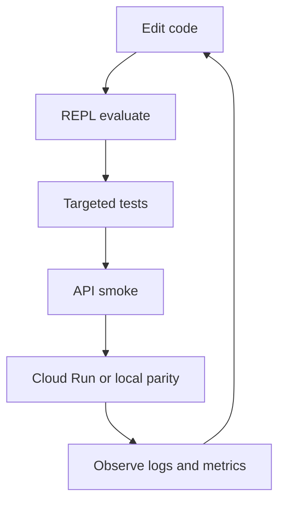
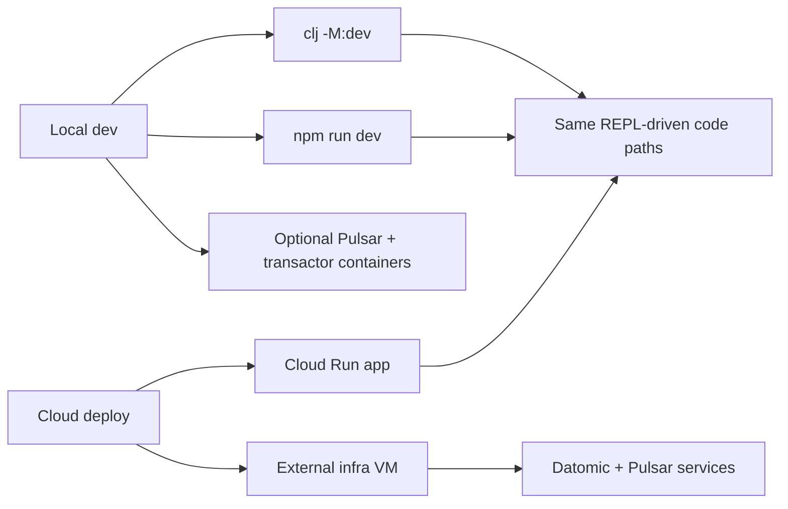

# Developer Ergonomics

This guide describes the working model for Little Trader: fast REPL feedback, local/cloud parity, MCP-assisted editing, and CI/CD that keeps the deployable path honest.

## Operating Model

The repo works best when the development loop stays tight:

1. Inspect the running app.
2. Modify a small slice of code.
3. Evaluate in REPL.
4. Verify with a smoke test or a targeted test run.
5. Deploy through the same shape of environment that runs in production.

## MCP And AI Augmentation

The repo already supports dual REPL workflows with `clojure-mcp`:

- Backend Clojure REPL on port `7888`.
- Browser / shadow-cljs REPL on port `9000`.
- One MCP server can bridge both when the local editor or Claude Desktop needs live feedback.

Practical guardrails:

- Keep AI-assisted changes scoped to one subsystem at a time.
- Prefer REPL inspection over large code generation.
- Use MCP for evaluation, file reads, and confirmation, not for broad refactors without review.

## Cloud Local Parity

Little Trader uses the same conceptual topology in local development and in cloud deployment:

- Datomic-backed application process.
- Optional Pulsar projection service for price feed materialization.
- Optional Deribit ingestion for market data and options.
- Cloud Run deploys the app container; separate infra can host stateful services.

## CI/CD Expectations

The pipeline should prove three things:

- The code compiles and the active tests pass.
- The app serves health, auth, EQL, and UI endpoints.
- The Cloud Run path stays configurable for staged Deribit and Pulsar behavior.

If a change cannot survive the CI smoke command, it should not be treated as production-ready.

## Workflow Rules

- Start with the REPL when you want to understand behavior.
- Use `clj -M:test` for logic changes and `bash ./scripts/ci-api-smoke.sh` for app-integrated changes.
- Prefer feature flags and env vars over ad hoc code branches.
- Keep production-only access behind explicit guardrails.
- Document the operational shape of a change at the same time you implement it.

## Docs Cross-References

- REPL workflow: [docs/CLOJURE_REPL_FIRST_CLASS.md](/Users/victorinacio/4coders/little-trader/docs/CLOJURE_REPL_FIRST_CLASS.md)
- Cloud setup: [docs/CLOUD_RUN_SETUP.md](/Users/victorinacio/4coders/little-trader/docs/CLOUD_RUN_SETUP.md)
- SRE guide: [docs/SRE_OPERATIONS.md](/Users/victorinacio/4coders/little-trader/docs/SRE_OPERATIONS.md)
- MCP guide: [MCP_DEVELOPMENT.md](/Users/victorinacio/4coders/little-trader/MCP_DEVELOPMENT.md)

