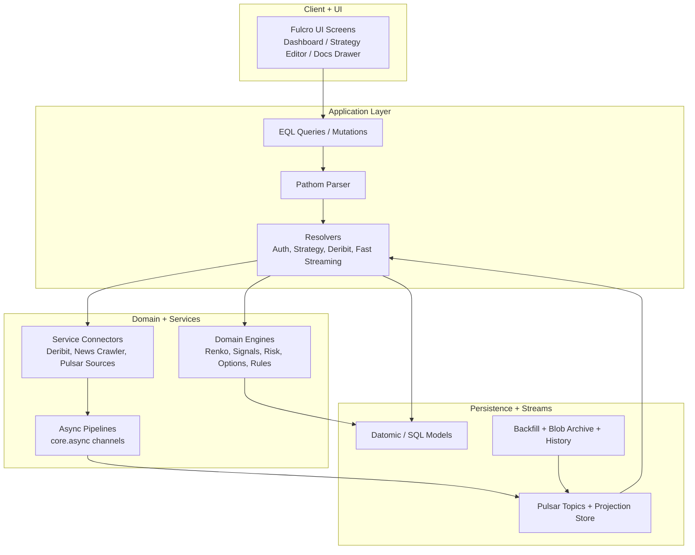
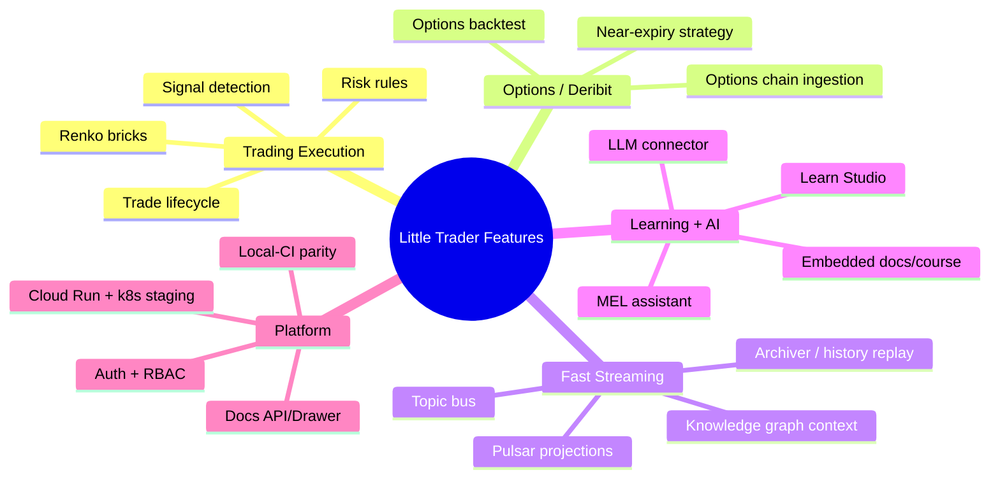
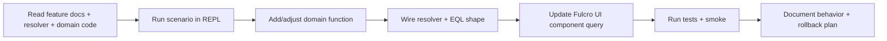
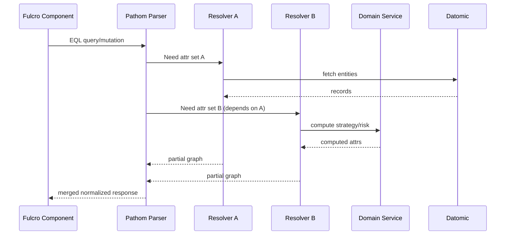
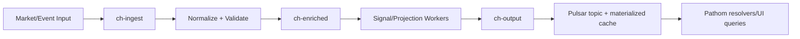
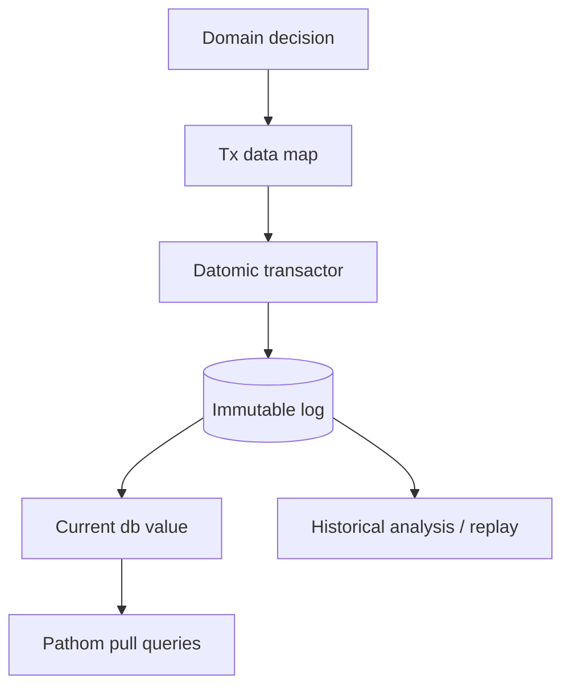
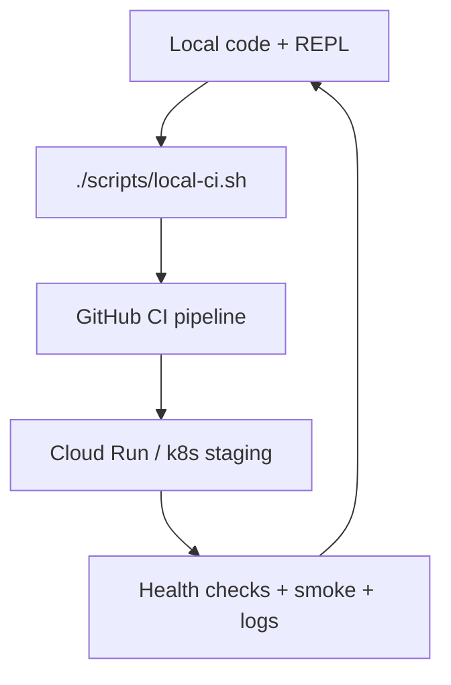
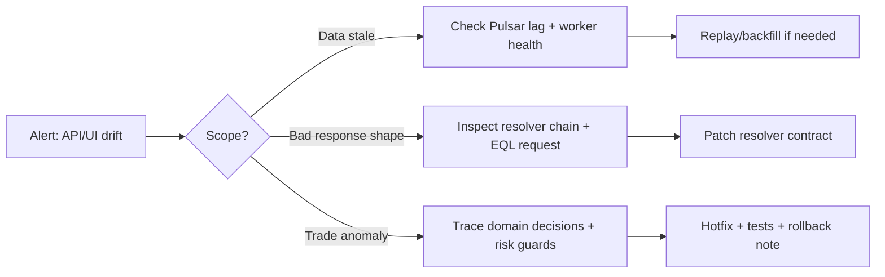
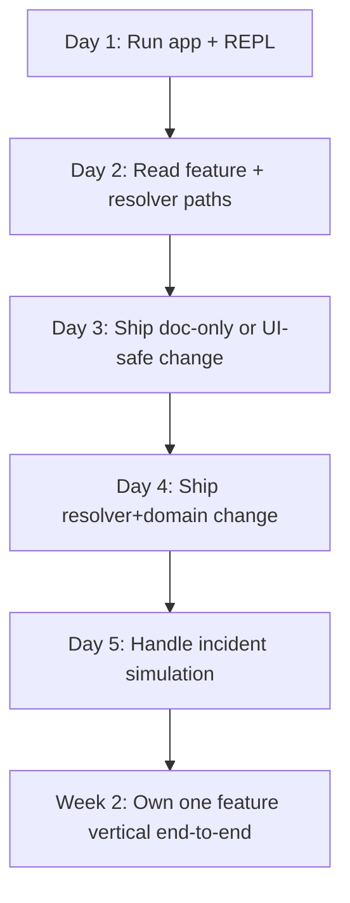

# Developer Onboarding Playbook (Top-Down + Feature-Wise)

> Audience: engineers joining Little Trader who need to bootstrap, understand architecture, run operations, and implement features safely.

## 0) First 90 Minutes (Fast Ramp)

### 0.1 Environment bootstrap

```bash
# 1) install JS deps
npm install

# 2) bring up full dev topology
docker compose --profile dev up --build

# 3) attach REPL and boot app in Clojure terminal
clj -M:dev
# in REPL:
(go)
```

Open:
- UI: `http://local.littletrader.dev:3000`
- API: `http://local.littletrader.dev:8080`
- nREPL: `localhost:7888`

### 0.2 Verify "known good" path

```bash
./scripts/local-ci.sh quick
```

This mirrors CI flow (test → docker build → run → smoke).

---

## 1) System Top-Down Map



### Design intent
- **Fulcro + EQL** keeps frontend data needs explicit.
- **Pathom resolvers** isolate integration and composition logic.
- **Domain layer** holds deterministic trading logic.
- **Pulsar + async pipelines** decouple ingestion from query serving.
- **Datomic** keeps source-of-truth state and queryable history.

---

## 2) Feature-Wise Capability Map



---

## 3) Core Developer Workflow (Understand → Implement → Validate)



### Practical checklist
1. Start from **use case** and target UI state.
2. Identify EQL query/mutation contract.
3. Find owning resolver namespace.
4. Trace domain call graph from resolver into domain/services.
5. Add tests at the lowest deterministic layer first.
6. Validate end-to-end with smoke or REPL scenario.

---

## 4) Fulcro + Pathom + EQL (Simple-Made-Easy Mental Model)

### 4.1 Fulcro
- UI components declare data requirements (`:query`) and identity (`:ident`).
- Mutations are explicit state transitions.
- Data-driven rendering avoids hidden fetch chains.

### 4.2 EQL
- EQL is a **shape request language**: frontend asks for exact graph shape.
- Queries are compositional and nest naturally with UI trees.

### 4.3 Pathom resolvers
- Resolver = unit that can produce attributes from inputs.
- Parser composes multiple resolvers to satisfy an EQL graph.
- Keep resolvers thin; move business math/decisions to domain namespaces.



---

## 5) Async Pipelines (core.async + Stream-first Ops)

Use channels for non-blocking, stage-oriented flow where latency and burst handling matter.



### Channel patterns to keep
- Small, composable transforms per stage.
- Explicit close/error semantics.
- Bounded buffering at burst boundaries.
- Deterministic test harness around stage functions.

---

## 6) Datomic in this system

### Why Datomic here
- Immutable facts + history for auditability.
- Temporal queries for strategy retrospectives.
- Rich pull-based reads for graph-shaped API responses.

### Operating model
- Write canonical domain events / entities.
- Read through resolvers with pull patterns.
- Keep projection/read-model workloads offloaded when high-frequency (Pulsar/materialized caches).



---

## 7) Dev/Ops: Day-2 Playbook

### 7.1 Build/test/deploy lanes



### 7.2 Required operational habits
- Always run local CI mirror before pushing.
- Treat smoke tests as release gate.
- Keep staging parity with local container topology.
- Add runbook notes when introducing new external dependencies (exchange, LLM provider, queue).

### 7.3 Incident-first diagnostics flow



---

## 8) New Feature Implementation Template

### 8.1 Contract-first skeleton
1. Define user story and acceptance criteria.
2. Define EQL contract (query/mutation shape).
3. Implement/extend resolver(s).
4. Implement domain function(s).
5. Add persistence/stream touchpoints.
6. Wire Fulcro components.
7. Add tests (domain + resolver + e2e/smoke).
8. Update docs tab docs + runbook.

### 8.2 Ready-to-fill spec card

```md
Feature:
User outcome:
Input signals/data:
EQL contract:
Resolvers touched:
Domain modules touched:
Persistence impact (Datomic/Pulsar):
Failure modes:
Metrics/logging:
Rollout plan:
Rollback plan:
```

---

## 9) Learning Path for New Engineers



Recommended reading sequence:
1. `README.md`
2. `FEATURES.md`
3. `docs/ARCHITECTURE_VISUAL_GUIDE.md`
4. `docs/SRE_OPERATIONS.md`
5. `docs/CLOJURE_REPL_FIRST_CLASS.md`
6. `docs/PULSAR_PRICE_LAYER.md`
7. `docs/EQL_ONLY_MIGRATION.md`

---

## 10) Glossary (for onboarding speed)
- **Fulcro**: Clojure(Script) app model for normalized client state + declarative data queries.
- **Pathom**: Graph parser that composes resolvers to fulfill EQL.
- **EQL**: Data graph query language used by Fulcro/Pathom.
- **Resolver**: Function that provides attributes based on available inputs.
- **core.async channel**: Queue-like primitive for asynchronous data flow.
- **Datomic**: Immutable, temporal database with pull-based graph querying.
- **Projection**: Derived read model for low-latency consumption.

---

## 11) What "Good" Looks Like for Contributions
- Small, reversible commits.
- Clear EQL contract and resolver ownership.
- Domain behavior proven with tests.
- Operational notes updated with rollout/rollback.
- Docs updated with at least one flow diagram when architecture changes.
