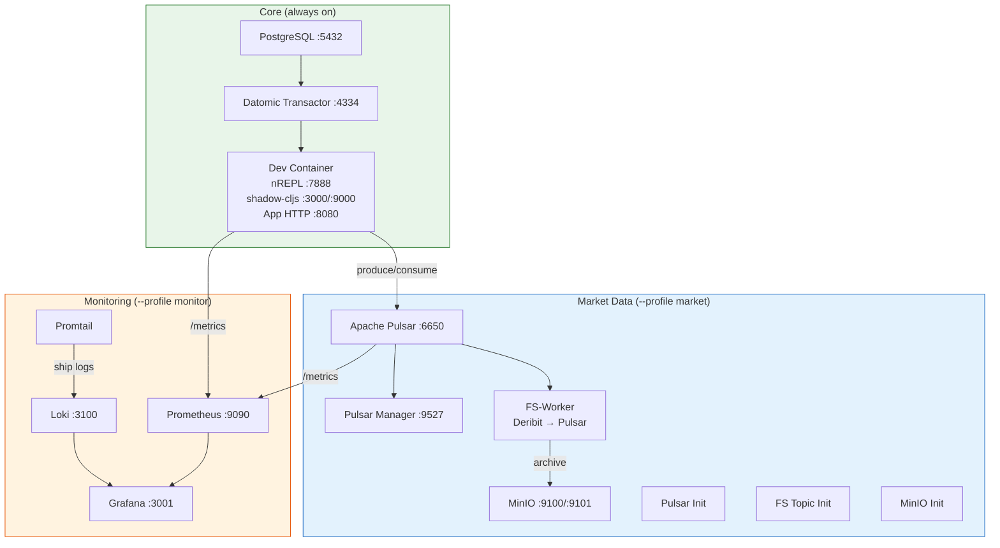
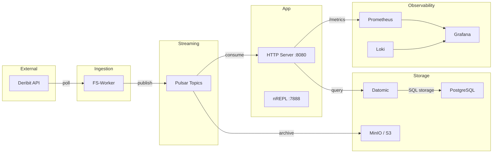
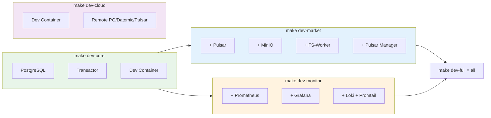
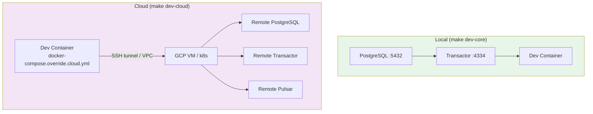

# DevOps CLI Guide — Little Trader

> Full software development lifecycle: build, test, deploy, monitor, recover.

## Table of Contents

1. [Architecture Overview](#architecture-overview)
2. [Profile Presets](#profile-presets)
3. [Quick Start](#quick-start)
4. [CLI Reference](#cli-reference)
5. [Service Reference](#service-reference)
6. [Monitoring Guide](#monitoring-guide)
7. [Cloud / Local Switching](#cloud--local-switching)
8. [Troubleshooting](#troubleshooting)
9. [Recovery Procedures](#recovery-procedures)
10. [Backup & Restore](#backup--restore)
11. [Resource Sizing](#resource-sizing)

---

## Architecture Overview

### Container Topology



### Data Flow



### Network & Ports

| Port | Service | Profile | Description |
|------|---------|---------|-------------|
| 3000 | shadow-cljs | dev | Frontend dev server (proxies /api to :8080) |
| 3001 | Grafana | monitor | Dashboards (admin/admin) |
| 3100 | Loki | monitor | Log aggregation API |
| 4334 | Datomic | core | Transactor peer protocol |
| 5432 | PostgreSQL | core | Datomic SQL storage |
| 6650 | Pulsar | market | Broker binary protocol |
| 7888 | nREPL | dev | Clojure REPL |
| 8080 | App HTTP | dev/prod | Ring server + /health + /metrics |
| 8081 | Pulsar Admin | market | Pulsar admin REST API |
| 9000 | shadow nREPL | dev | ClojureScript REPL |
| 9090 | Prometheus | monitor | Metrics collection |
| 9100 | MinIO S3 | market | S3-compatible API |
| 9101 | MinIO Console | market | Web UI |
| 9527 | Pulsar Manager | market | Pulsar Web UI |
| 9630 | shadow devtools | dev | shadow-cljs WebSocket |

---

## Profile Presets

| Preset | Command | Services | RAM Est. |
|--------|---------|----------|----------|
| **core** | `make dev-core` | PostgreSQL + Datomic + Dev (REPL + shadow) | ~2 GB |
| **market** | `make dev-market` | Core + Pulsar + MinIO + FS-Worker | ~4 GB |
| **monitor** | `make dev-monitor` | Core + Prometheus + Grafana + Loki | ~3 GB |
| **full** | `make dev-full` | Core + Market + Monitor (everything) | ~6 GB |
| **cloud** | `make dev-cloud` | Dev container only (remote infra) | ~1 GB |
| **prod** | `docker compose --profile prod up` | Production app image | ~1 GB |

### Preset Topology Diagram



---

## Quick Start

### First Time Setup

```bash
# 1. Clone and install
git clone https://github.com/4coders-com-br/little-trader.git
cd little-trader
npm install
cp .env.example .env

# 2. Initialize data directories
./scripts/init-data-dirs.sh

# 3. Start core development
make dev-core

# 4. Wait for startup (~30s), then verify
make health

# 5. Connect REPL and boot app
# In your editor, connect nREPL to localhost:7888, then:
#   (go)
```

### Daily Development

```bash
make dev-core           # Start core dev
# ... code, REPL, test ...
make test               # Run tests
make smoke              # API smoke test
make down               # Stop everything
```

### Full Stack with Monitoring

```bash
make dev-full           # Start everything
make monitor            # See dashboard URLs
open http://localhost:3001  # Grafana
```

---

## CLI Reference

### Makefile (Quick Commands)

```bash
# ── Development Presets ──
make dev-core           # pg + datomic + dev (REPL + shadow-cljs)
make dev-market         # core + pulsar + minio + fs-worker
make dev-monitor        # core + prometheus + grafana + loki
make dev-full           # everything
make dev-cloud          # dev container → cloud infrastructure

# ── Container Lifecycle ──
make up                 # Start (current profile)
make down               # Stop + remove all
make stop               # Stop (keep volumes)
make restart            # Restart all
make logs               # Tail all container logs
make ps                 # Show running containers

# ── Build & Test ──
make test               # Run Kaocha tests
make lint               # Run clj-kondo
make build              # ClojureScript + uberjar
make docker             # Build production Docker image
make ci                 # Full CI pipeline (test→lint→docker→smoke)
make smoke              # API smoke test

# ── Monitoring ──
make monitor            # Show dashboard URLs
make health             # Deep health check all services
make repl               # Connect nREPL

# ── Database ──
make backup-db          # pg_dump → backups/
make restore-db         # Restore from latest (or BACKUP=path)
make db-console         # Open psql

# ── Cleanup ──
make clean              # Remove build artifacts
make reset              # Full reset (down + volumes + clean)

make help               # Show all targets
```

### ./lt CLI (Advanced Operations)

```bash
# ── Development ──
./lt dev core           # Start core dev environment
./lt dev market         # Core + market data
./lt dev monitor        # Core + monitoring
./lt dev full           # Everything
./lt dev cloud          # Cloud-backed dev

# ── Lifecycle ──
./lt stop               # Stop all containers
./lt restart [service]  # Restart specific or all
./lt status             # Health matrix + container status
./lt logs [svc] [-f]    # Tail logs
./lt pulsar-admin ...   # Run Pulsar admin inside the market stack

# ── Build & Test ──
./lt test [all|domain|smoke|cljs]
./lt build [cljs|jar|docker|all]
./lt deploy [staging|production]

# ── Monitoring ──
./lt monitor            # Dashboard URLs (opens Grafana)
./lt health             # Full health check
./lt recover [service]  # Restart unhealthy services

# ── Database ──
./lt db console         # Open psql
./lt db backup          # Backup to backups/
./lt db restore [file]  # Restore from backup
./lt db migrate         # Apply schema (restart app)

# ── REPL ──
./lt repl clj           # Connect Clojure nREPL (:7888)
./lt repl cljs          # Connect shadow-cljs REPL
./lt repl remote h p    # Connect to remote nREPL

# ── Cloud ──
./lt cloud connect      # Setup port-forwards
./lt cloud status       # Show cloud config
./lt cloud port-forward # SSH tunnel to infra VM
./lt cloud deploy-infra # Deploy infra to VM

# ── Maintenance ──
./lt clean [cache|volumes|all]
./lt doctor             # Diagnose environment
./lt help               # Full command reference
```

`./lt pulsar-admin` defaults to the local market stack preset and runs
`bin/pulsar-admin --admin-url http://localhost:8080` inside the `pulsar`
container. Override the target with either an explicit preset or env vars:

```bash
./lt pulsar-admin topics list public/default
./lt pulsar-admin topics stats-internal persistent://public/default/market-data.btc.ohlcv.1h
./lt pulsar-admin cloud brokers healthcheck

LT_PULSAR_ADMIN_PRESET=cloud \
LT_PULSAR_ADMIN_URL=http://host.docker.internal:8081 \
./lt pulsar-admin brokers healthcheck
```

---

## Service Reference

### PostgreSQL

| Property | Value |
|----------|-------|
| Image | `postgres:15-alpine` |
| Port | 5432 |
| Credentials | datomic / datomic |
| Database | datomic |
| Data | `$LT_DATA_DIR/postgres` (bind mount) |
| Health | `pg_isready -U datomic` |

**Console:** `make db-console` or `./lt db console`

### Datomic Transactor

| Property | Value |
|----------|-------|
| Dockerfile | `Dockerfile.transactor` |
| Port | 4334 |
| Storage | SQL via PostgreSQL |
| Config | `config/transactor.properties` |
| Health | `nc -z localhost 4334` |

**Schema:** Applied at app startup via `com.little-trader.data.schema`

### Dev Container

| Property | Value |
|----------|-------|
| Dockerfile | `Dockerfile.dev` |
| Ports | 7888 (nREPL), 9000 (shadow nREPL), 3000 (shadow HTTP), 8080 (app) |
| Entrypoint | `scripts/dev-entrypoint.sh` |
| Volumes | Source mounted at `/app` |

**REPL:** Connect to `localhost:7888`, then `(go)` to start the app.

### Apache Pulsar

| Property | Value |
|----------|-------|
| Image | `apachepulsar/pulsar:3.2.4` |
| Ports | 6650 (broker), 8081 (admin) |
| Profile | `market` |
| Data | `pulsar-data` named volume |
| Topics | See `resources/fast-streaming/topology.edn` |

### MinIO

| Property | Value |
|----------|-------|
| Image | `minio/minio:latest` |
| Ports | 9100 (S3 API), 9101 (Console) |
| Credentials | littletrader / littletrader123 |
| Buckets | `fast-streaming`, `fast-streaming-archive` |

### Prometheus

| Property | Value |
|----------|-------|
| Image | `prom/prometheus:v2.51.2` |
| Port | 9090 |
| Config | `config/prometheus.yml` |
| Retention | 7 days |
| Scrape targets | App :8080/metrics, Pulsar :8080/metrics |

### Grafana

| Property | Value |
|----------|-------|
| Image | `grafana/grafana:11.0.0` |
| Port | 3001 |
| Credentials | admin / admin |
| Datasources | Prometheus, Loki (auto-provisioned) |
| Dashboards | App Health, Pulsar Topics, PostgreSQL (auto-loaded) |

### Loki

| Property | Value |
|----------|-------|
| Image | `grafana/loki:3.0.0` |
| Port | 3100 |
| Config | `config/loki.yml` |
| Retention | 7 days |

---

## Monitoring Guide

### Grafana Dashboards

After `make dev-monitor` or `make dev-full`, open http://localhost:3001 (admin/admin).

**Pre-provisioned dashboards:**

1. **App Health** — HTTP request rate, latency percentiles, JVM heap/threads/GC, error rates, app logs
2. **Pulsar Topics** — Message rate in/out, backlog size, storage, subscription count, Pulsar logs
3. **PostgreSQL & Datomic** — Connection logs, transactor logs, infrastructure logs

### Querying Logs in Grafana (Loki)

```logql
# All app logs
{com_docker_compose_service="dev"}

# App errors only
{com_docker_compose_service="dev"} |= "ERROR"

# Pulsar worker logs
{com_docker_compose_service="fs-worker"}

# All logs from all services
{job="docker"}

# Filter by text
{com_docker_compose_service=~"dev|app"} |= "signal"
```

### Prometheus Queries

```promql
# HTTP request rate
rate(http_requests_total[5m])

# JVM heap usage
jvm_memory_bytes_used{area="heap"}

# GC pause rate
rate(jvm_gc_collection_seconds_sum[5m])

# Pulsar message rate
sum(rate(pulsar_rate_in[5m])) by (topic)
```

### App Metrics Endpoint

`GET http://localhost:8080/metrics` returns Prometheus text format:

- `jvm_memory_bytes_used` / `committed` / `max` (heap, nonheap)
- `jvm_threads_current` / `daemon` / `peak`
- `jvm_gc_collection_seconds_sum` / `count` per collector
- `jvm_uptime_seconds`
- `http_requests_total{method, path, status}`
- `http_request_duration_seconds_avg`

---

## Cloud / Local Switching

### Local Development (default)

Everything runs in Docker on your machine:

```bash
make dev-core    # or dev-market, dev-full
```

### Cloud-Backed Development

Point your dev container at remote infrastructure (GCP VM, k8s, etc.):

```bash
# Option 1: Direct connection (if VM is accessible)
echo 'CLOUD_PG_HOST=10.128.0.2' >> .env
echo 'CLOUD_PULSAR_HOST=10.128.0.2' >> .env
make dev-cloud

# Option 2: SSH tunnel
./lt cloud port-forward datomic-transactor
# In another terminal:
make dev-cloud

# Option 3: kubectl port-forward
kubectl -n staging port-forward svc/postgres 5432:5432 &
kubectl -n staging port-forward svc/transactor 4334:4334 &
kubectl -n staging port-forward svc/pulsar 6650:6650 &
make dev-cloud
```

### Deploy Infrastructure to Cloud VM

```bash
# SSH into VM
gcloud compute ssh datomic-transactor --zone=us-central1-a

# On the VM:
cd /opt/little-trader
git pull
ALT_HOST=$(hostname -I | awk '{print $1}') \
  docker compose -f docker-compose.infra.yml up -d
```

### Switching Back to Local

```bash
make down
make dev-core  # Uses local postgres/transactor
```

### Architecture: Local vs Cloud



---

## Troubleshooting

### Common Issues

| Symptom | Cause | Fix |
|---------|-------|-----|
| Port 5432 already in use | Local PostgreSQL running | `brew services stop postgresql` or change port in .env |
| Port 8080 already in use | Another server running | Kill process: `lsof -ti:8080 \| xargs kill` |
| Transactor won't start | PostgreSQL not ready | Wait for PG healthcheck; check `make logs` |
| nREPL unreachable | Dev container still starting | Wait 30s; check `docker compose logs dev` |
| shadow-cljs compile errors | Stale node_modules | `make clean && npm install` |
| Datomic connection refused | Wrong DATOMIC_URI | Check .env; ensure transactor is healthy |
| Pulsar health fails | Needs 30s+ startup time | Increase `start_period` or just wait |
| Grafana "No data" | Prometheus not scraping | Check `http://localhost:9090/targets` |
| Loki empty | Promtail not running | Check `docker compose logs promtail` |
| OOM / Docker crashes | Insufficient Docker memory | Increase Docker Desktop memory to 8GB+ |
| FS-Worker fails | Pulsar not ready | Ensure Pulsar healthcheck passes first |
| Cloud dev can't connect | Port-forward not running | Run `./lt cloud port-forward` or check SSH tunnel |

### Diagnostic Commands

```bash
# Full environment diagnosis
./lt doctor

# Service health matrix
./lt status

# Check specific container
docker compose logs transactor --tail=50

# Check port usage
lsof -i :8080

# Docker resource usage
docker stats

# Datomic transactor log
docker compose logs transactor -f

# PostgreSQL connections
docker compose exec postgres psql -U datomic -c "SELECT count(*) FROM pg_stat_activity;"
```

---

## Recovery Procedures

### Service Won't Start

```bash
# 1. Check logs
./lt logs [service]

# 2. Restart the service
./lt restart [service]

# 3. If still failing, check dependencies
./lt status

# 4. Nuclear option: full reset
make reset
make dev-core
```

### Unhealthy Services

```bash
# Auto-recover all unhealthy
./lt recover

# Recover specific service
./lt recover transactor
```

### Corrupt Database

```bash
# 1. Stop everything
make stop

# 2. Restore from backup
./lt db restore backups/datomic-20260330-120000.sql.gz

# 3. Restart
make dev-core
```

### Full Reset (Nuclear)

```bash
make reset              # Removes ALL volumes and data
make dev-core           # Fresh start
```

---

## Backup & Restore

### Create Backup

```bash
make backup-db
# → backups/datomic-YYYYMMDD-HHMMSS.sql.gz

# Or via CLI
./lt db backup
```

### Restore Backup

```bash
# Restore latest
make restore-db

# Restore specific file
BACKUP=backups/datomic-20260330-120000.sql.gz make restore-db

# Or via CLI
./lt db restore backups/datomic-20260330-120000.sql.gz
```

### Automated Backup Schedule

For production, add a cron job:

```bash
# Daily backup at 3am
0 3 * * * cd /opt/little-trader && make backup-db
```

---

## Resource Sizing

### Per-Service Memory

| Service | RAM (idle) | RAM (active) | CPU |
|---------|-----------|-------------|-----|
| PostgreSQL | 50 MB | 100 MB | Low |
| Transactor | 300 MB | 500 MB | Low |
| Dev Container | 500 MB | 1.2 GB | Medium |
| Pulsar | 800 MB | 1.5 GB | Medium |
| FS-Worker | 128 MB | 256 MB | Low |
| MinIO | 100 MB | 200 MB | Low |
| Prometheus | 100 MB | 300 MB | Low |
| Grafana | 100 MB | 200 MB | Low |
| Loki | 100 MB | 300 MB | Low |
| Promtail | 30 MB | 50 MB | Low |

### Recommended Docker Desktop Settings

| Preset | Min Memory | Recommended Memory | Disk |
|--------|-----------|-------------------|------|
| core | 4 GB | 6 GB | 20 GB |
| market | 6 GB | 8 GB | 30 GB |
| monitor | 4 GB | 6 GB | 25 GB |
| full | 8 GB | 12 GB | 40 GB |

---

## File Reference

```
project-root/
├── Makefile                              # Quick CLI targets
├── lt → scripts/lt                       # Advanced CLI symlink
├── docker-compose.yml                    # Main compose (core + market + monitor profiles)
├── docker-compose.override.cloud.yml     # Cloud infrastructure override
├── docker-compose.infra.yml              # Cloud VM infrastructure
├── docker-compose.worker.yml             # Standalone FS-Worker VM
├── Dockerfile                            # Production multi-stage build
├── Dockerfile.dev                        # Dev container (nREPL + shadow-cljs)
├── Dockerfile.transactor                 # Datomic transactor
├── Dockerfile.fast-streaming             # FS-Worker standalone
├── .env.example                          # Environment template
├── config/
│   ├── transactor.properties             # Datomic transactor config
│   ├── prometheus.yml                    # Prometheus scrape config
│   ├── loki.yml                          # Loki storage config
│   ├── promtail.yml                      # Docker log shipper config
│   └── grafana/
│       ├── provisioning/
│       │   ├── datasources/datasources.yml
│       │   └── dashboards/dashboards.yml
│       └── dashboards/
│           ├── app-health.json           # App metrics dashboard
│           ├── pulsar-topics.json        # Streaming dashboard
│           └── postgres-overview.json    # Database dashboard
├── scripts/
│   ├── lt                                # Advanced CLI script
│   ├── local-ci.sh                       # Local CI pipeline
│   ├── ci-api-smoke.sh                   # API smoke test
│   ├── dev-entrypoint.sh                 # Dev container entrypoint
│   ├── init-pg-schema.sh                 # PostgreSQL schema init
│   ├── init-data-dirs.sh                 # Host data directories
│   └── mcp-preflight.sh                  # MCP environment check
└── docs/
    ├── DEVOPS_CLI_GUIDE.md               # This file
    ├── SRE_OPERATIONS.md                 # Cloud Run operations
    ├── DEVELOPER_ERGONOMICS.md           # Development workflow
    └── DEVELOPER_ONBOARDING_PLAYBOOK.md  # Onboarding guide
```
