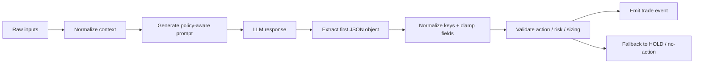
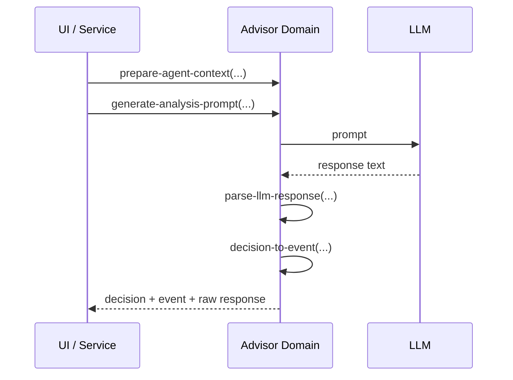

# LLM Strategy Advisor

## Purpose

The LLM Strategy Advisor turns market context into a constrained trading recommendation. It is designed for:

- Fast human-in-the-loop review
- Simulation and paper-trading workflows
- Conservative live decision support with explicit guardrails
- Configurable risk policy without depending on the rest of the app

Implementation lives in [`src/com/little_trader/domain/llm_agent.clj`](/Users/victorinacio/4coders/little-trader/src/com/little_trader/domain/llm_agent.clj) and is covered by [`test/com/little_trader/domain/llm_agent_test.clj`](/Users/victorinacio/4coders/little-trader/test/com/little_trader/domain/llm_agent_test.clj).

Transport/runtime selection now lives in [`src/com/little_trader/llm/connector.clj`](/Users/victorinacio/4coders/little-trader/src/com/little_trader/llm/connector.clj), which provides provider implementations for Anthropic, OpenAI, local OpenAI-compatible servers, and mock mode.

## What It Does

The advisor consumes:

- Recent price history
- An NN signal or other technical signal payload
- Optional sentiment / news context
- Optional current position state
- Optional advisor policy overrides

It then produces:

- A prompt for an LLM
- A parsed recommendation
- A normalized trade event or a fail-closed no-action event

## Decision Lifecycle





## Capability Set

### Provider connector layer

- Normalizes provider selection behind a single protocol
- Supports:
  - Anthropic Messages API
  - OpenAI Responses API
  - Local OpenAI-compatible `chat/completions` endpoints
  - Mock mode for development and tests
- Exposes `prompt->response-fn` so the domain advisor can stay transport-agnostic

Example:

```clojure
(require '[com.little-trader.domain.llm-agent :as agent]
         '[com.little-trader.llm.connector :as connector])

(def llm (connector/connector-from-env))

(agent/consult-agent
 context
 (connector/prompt->response-fn
  llm
  "You are a trading strategy advisor. Return one JSON object only."))
```

### Context normalization

- Accepts prices as raw numbers or bar-like maps
- Normalizes symbols to uppercase
- Produces derived fields like:
  - 1-bar / 5-bar / 20-bar returns
  - volatility assessment
  - recent range position
  - technical trend and MA crossover state
- Clamps sentiment values into sane bounds

### Prompt generation

- Includes market, technical, sentiment, and position sections
- Embeds a policy summary so the model sees the constraints directly
- Can be tuned with a domain-local advisor config
- Supports both long and quick prompt modes

### Response parsing

- Extracts JSON from markdown code blocks or prose
- Normalizes snake_case and kebab-case fields
- Accepts action values from multiple formats
- Sanitizes reasoning text
- Clamps confidence and position sizing

### Recommendation validation

- Rejects unknown or unsafe actions
- Fails closed on malformed responses
- Applies risk bounds for stop-loss and take-profit
- Enforces a configurable maximum position size
- Can disable long or short entries independently

### Event translation

- Converts recommendations into trade events
- Falls back to no-action if market price is missing
- Preserves warnings for downstream visibility
- Keeps source and timestamps explicit

## Guardrails

The advisor is intentionally conservative.

- Unknown actions are downgraded to the configured fallback action
- Invalid JSON or no JSON produces a safe fallback
- Confidence is normalized to `0.0..1.0`
- Position size is capped by `:max-position-size`
- Risk prices must align with the action direction
- Stop loss and take profit default to policy values when invalid
- Entry and exit actions fail closed if current price is unavailable
- Reasoning text is trimmed to a bounded length

## Configuration

The advisor keeps its policy in the domain layer so callers do not need to depend on app-wide config plumbing.

Current defaults:

| Key | Default | Purpose |
|---|---:|---|
| `:enabled?` | `true` | Domain-level on/off switch |
| `:min-confidence` | `0.60` | Minimum confidence for high-conviction actions |
| `:max-position-size` | `0.20` | Hard cap on position sizing |
| `:default-position-size` | `0.10` | Used when the model omits size |
| `:default-stop-loss-pct` | `0.02` | Default stop distance |
| `:default-take-profit-pct` | `0.04` | Default profit target distance |
| `:min-stop-distance-pct` | `0.01` | Rejects stops too close to market |
| `:max-stop-distance-pct` | `0.12` | Rejects stops too far from market |
| `:max-reasoning-length` | `400` | Trims verbose model explanations |
| `:allow-long?` | `true` | Directional kill-switch for longs |
| `:allow-short?` | `true` | Directional kill-switch for shorts |
| `:allowed-actions` | set of all supported actions | Action whitelist |
| `:strict-response?` | `true` | Prefer fail-closed behavior |
| `:strict-risk?` | `true` | Force invalid risk prices back to defaults |
| `:fallback-action` | `:hold` | Action used on unsafe output |
| `:hold-action-reason` | `Advisor fallback due to unsafe or incomplete response` | Reasoning used when fallback is emitted |

Example override:

```clojure
(agent/update-agent-config! {:min-confidence 0.70
                             :max-position-size 0.12
                             :allow-short? false
                             :default-stop-loss-pct 0.03
                             :default-take-profit-pct 0.06})
```

Per-call overrides can also be supplied through the context passed into `prepare-agent-context`, `consult-agent`, or `simulate-agent-decision`.

## Output Contract

The ideal model response is a single JSON object with:

- `action`
- `confidence`
- `reasoning`
- `stop_loss`
- `take_profit`
- `position_size`

The domain layer accepts a looser surface than the contract suggests, but any values outside policy are normalized, capped, or rejected.

### Valid actions

- `ENTER_LONG`
- `ENTER_SHORT`
- `EXIT`
- `HOLD`
- `STOP_LOSS`
- `TAKE_PROFIT`

## Example Flows

### 1. Prepare a context and consult the advisor

```clojure
(def context
  (agent/prepare-agent-context
   {:nn-signal {:prediction :buy
                :confidence 0.88
                :crossover :golden-cross
                :matches-strategy? true}}
   [100.0 101.0 102.5 103.1 104.0]
   "BTC/USD"
   :sentiment {:market-mood :bullish
               :fear-greed-index 68}
   :position nil
   :advisor-config {:max-position-size 0.12}))

(agent/consult-agent context
                     (fn [_]
                       "{\"action\":\"ENTER_LONG\",\"confidence\":0.91,\"reasoning\":\"Trend + momentum\"}"))
```

### 2. Run a simulation when no LLM is available

```clojure
(agent/simulate-agent-decision
 context
 {:min-confidence 0.65
  :default-position-size 0.08})
```

### 3. Handle a malformed response safely

```clojure
(agent/parse-llm-response
 "Here is the idea: ```json {\"action\":\"BUY_NOW\"} ```")
```

Expected behavior:

- Unknown action is rejected
- Response is normalized to a fallback action
- Warnings are attached
- No unsafe live trade is emitted

## Limits

- The advisor is not an execution engine
- It does not fetch its own news or market feeds
- It does not manage portfolio-level allocation across symbols
- It assumes the caller supplies a current market price when trade events need one
- It should not be treated as a substitute for execution risk controls

## Failure Modes and Fallbacks

- No JSON found: return a safe fallback decision
- JSON found but invalid: return a safe fallback decision
- Unsafe action: downgrade to fallback action
- Confidence too low for entry: downgrade to fallback action
- Invalid stop or target: clamp to safe defaults when strict risk is enabled
- Missing current price for open/close actions: emit no-action instead of a trade event

## Testing Notes

The test suite exercises:

- Context normalization on mixed input shapes
- Prompt generation with policy-sensitive values
- JSON extraction from markdown and prose
- Confidence and position-size clamping
- Stop-loss / take-profit validation
- Missing-price fail-closed behavior
- Config reset, mutation, and per-call override behavior

## Operational Guidance

- Keep `:strict-risk?` enabled in production-like environments
- Use smaller `:max-position-size` values for live trading than simulation
- Treat advisor prompts as a contract, not a suggestion
- Prefer fallback behavior over forcing a trade when policy is unclear
- Review warnings and rejected decisions in downstream telemetry
