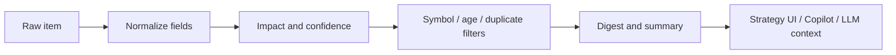

# News and Data Crawlers

This document describes the news and data ingestion layer for Little Trader. The goal is not "more data at any cost"; the goal is curated, normalized, explainable inputs that can safely influence strategy context and LLM advisory flows.

## Navigation

- [Embedded Course and Manual](/Users/victorinacio/4coders/little-trader/docs/EMBEDDED_COURSE_AND_MANUAL.md)
- [Architecture Visual Guide](/Users/victorinacio/4coders/little-trader/docs/ARCHITECTURE_VISUAL_GUIDE.md)
- [C4 Architecture](/Users/victorinacio/4coders/little-trader/docs/C4_ARCHITECTURE.md)

## Design Goals

- Normalize raw items from APIs, RSS feeds, manual inputs, and scrapers.
- Deduplicate repeated headlines.
- Score impact before surfacing items to the UI or strategy context.
- Keep the ingestion layer transport-agnostic.
- Make the source of each item visible in the UI and logs.

## What Counts As A Crawler

A crawler in this project can be any of the following:

- RSS or Atom feed reader
- Public news API client
- Manual analyst input channel
- Exchange announcement poller
- Data enrichment step that annotates raw items with symbols, sentiment, or impact

## Normalization Pipeline

## Field Model

Recommended canonical item fields:

- `news/id`
- `news/source`
- `news/headline`
- `news/summary`
- `news/url`
- `news/published-at-ms`
- `news/kind`
- `news/symbols`
- `news/sentiment`
- `news/impact-score`
- `news/confidence`
- `news/raw`

## Guardrails

- Reject items without meaningful content.
- Clamp confidence and impact scores to a sane range.
- Prefer explicit symbol mapping over weak inference.
- Deduplicate repeated headlines from the same source.
- Drop stale items outside the configured age window.
- Keep symbol relevance visible rather than implicit.

## Operational Filters

Use these filters before an item is considered useful:

- Maximum age in minutes
- Minimum impact score
- Tracked symbol allowlist
- Deduplication window
- Maximum items per digest

## Ranking Approach

Rank items by a combination of:

- recency
- impact score
- source trust
- symbol relevance
- signal density

Do not let a single noisy source dominate the digest.

## LLM Context Use

When used by the LLM strategy advisor, the news layer should provide:

- a compact digest
- top headlines per symbol
- sentiment breakdown
- source provenance
- a warning when the digest is sparse or stale

The advisor should treat news as one input among many, not as an automatic trade trigger.

## UI Behavior

News should be surfaced in a way that answers three questions:

- Why is this item relevant?
- Which symbol is it attached to?
- Is this item actionable or just informative?

The UI should make it obvious when a news item is speculative, stale, or low confidence.

## Source Types

### Manual

Best for curated analyst notes and release-day annotations. Lowest automation risk.

### RSS

Best for broad market and macro coverage. Requires aggressive dedupe and source filtering.

### API

Best for structured feeds with timestamps and metadata. Preferred for alerting and dashboards.

### Exchange announcement

Best for maintenance events, product launches, and contract changes. High relevance for operational monitoring.

## Failure Modes

- Feed outage: show the last successful digest and surface staleness.
- Duplicate storms: collapse repeated headlines and reduce score weight.
- Weak symbol matching: require manual confirmation before using in strategy context.
- Bad timestamps: discard or quarantine the item.
- Overconfident summaries: keep provenance in the payload.

## Strategy Integration

The ingestion layer should support these strategy uses:

- advisory context for LLM prompts
- manual review panels
- training data generation for future ranking models
- event timelines for post-trade analysis

News should never be the only reason a trade exists. It should explain, confirm, or contextualize what the system already sees.

## Suggested Source Policy

- `Production`: only trusted sources and well-formed API feeds
- `Staging`: production-like feeds with lower blast radius
- `Local`: manual fixtures and sample digests

## What To Build Next

If this layer grows further, the next additions should be:

- persistent crawler registry
- source health dashboard
- digest diff view
- per-source quality metrics
- exportable event timeline for post-trade review

