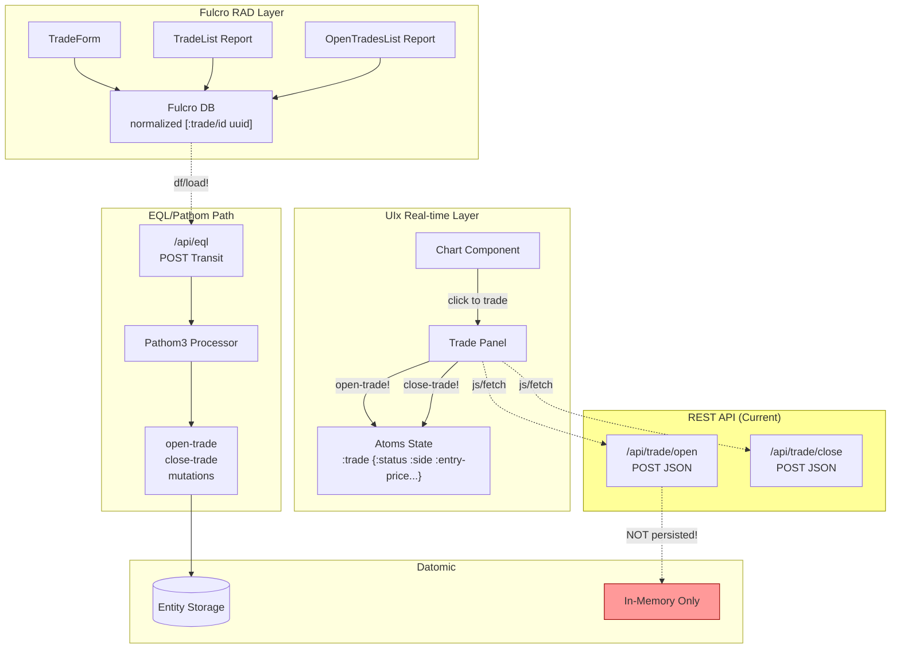
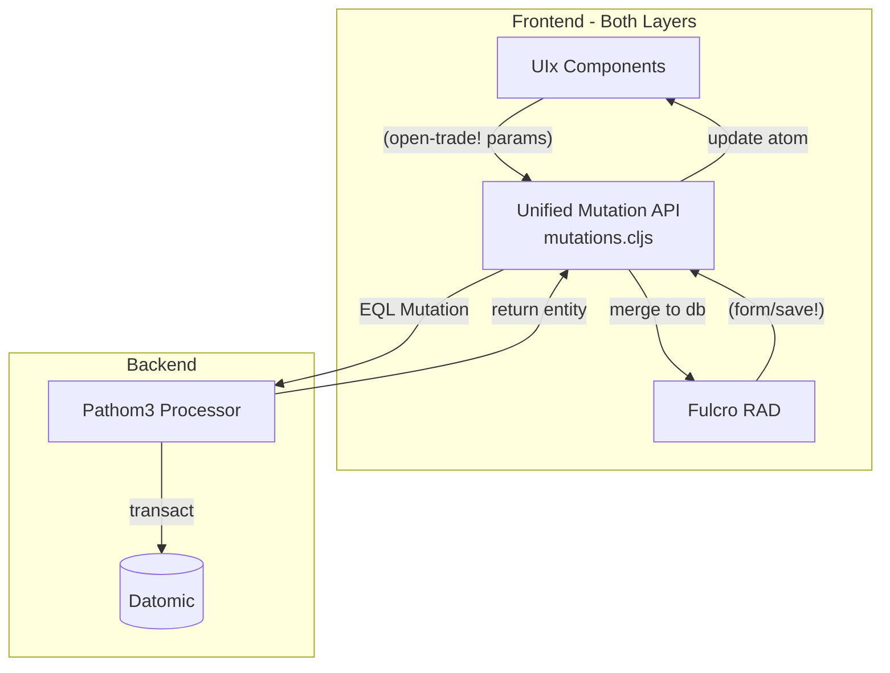

# Trade Lifecycle: UIx ↔ RAD Integration Analysis

## Current State: Two Parallel Paths



## The Problem: State Bifurcation

### Current Trade Lifecycle

| Action | UIx Path | Fulcro RAD Path | Datomic |
|--------|----------|-----------------|---------|
| Open Trade from Chart | `state.cljs/open-trade!` → `/api/trade/open` | ❌ Not aware | ❌ Not persisted |
| Close Trade from Chart | `state.cljs/close-trade!` → `/api/trade/close` | ❌ Not aware | ❌ Not persisted |
| View Open Trades | `app-state` atom | `OpenTradesList` report → empty | No data |
| View Trade History | ❌ Not available | `TradeList` report → empty | No data |
| Create Trade from Form | ❌ Not available | `TradeForm` → Pathom mutation | ✅ Persisted |

**Key Issue**: Trades initiated from UIx chart don't reach Datomic, so RAD reports show nothing.

---

## Integration Strategies

### Strategy 1: UIx Uses EQL Mutations (Recommended)

Replace REST calls with Pathom mutations directly from UIx.

```clojure
;; state.cljs - BEFORE (REST)
(defn open-trade! [side]
  (-> (js/fetch "/api/trade/open" ...)
      (.then #(set-trade! (:trade %)))))

;; state.cljs - AFTER (EQL via Pathom)
(defn open-trade! [side account-id]
  (let [price (:close (last (get-state [:bricks])))]
    (-> (js/fetch "/api/eql"
                  #js {:method "POST"
                       :headers #js {"Content-Type" "application/transit+json"}
                       :body (pr-str 
                              `[(com.little-trader.components.resolvers/open-trade
                                 {:account-id ~account-id
                                  :symbol "BTC/USD"
                                  :side ~side
                                  :price ~price
                                  :amount 0.01})])})
        (.then #(.text %))
        (.then #(let [result (cljs.reader/read-string %)]
                  (set-trade! (-> result first :trade/id)))))))
```

**Pros**:
- Single source of truth (Datomic)
- RAD reports work automatically
- Computed attributes (P&L, metrics) available everywhere
- Audit trail via Datomic history

**Cons**:
- Slightly higher latency for UIx (HTTP round-trip for each mutation)
- Need to handle optimistic updates manually in UIx atoms

---

### Strategy 2: Shared State Bridge (Hybrid)

Create a bridge layer that synchronizes UIx atoms with Fulcro DB.

```clojure
;; bridge.cljs
(ns com.little-trader.ui.bridge
  (:require [com.fulcrologic.fulcro.application :as app]
            [com.little-trader.ui.state :as state]
            [com.little-trader.ui.client :as client]))

(defn sync-trade-to-fulcro!
  "When UIx opens a trade, normalize it into Fulcro DB."
  [trade]
  (let [trade-ident [:trade/id (:trade/id trade)]]
    (swap! (::app/state-atom client/app)
           assoc-in trade-ident trade)
    ;; Trigger background persistence
    (df/load! client/app trade-ident trade-forms/TradeForm
              {:remote :remote
               :post-mutation `persist-trade})))

;; Watch UIx atom changes
(add-watch state/app-state :fulcro-sync
  (fn [_ _ old new]
    (when (not= (:trade old) (:trade new))
      (sync-trade-to-fulcro! (:trade new)))))
```

**Pros**:
- Immediate UIx responsiveness (optimistic)
- Background sync to Datomic
- Both views stay synchronized

**Cons**:
- Complex state management
- Potential race conditions
- Two sources of truth during sync window

---

### Strategy 3: Event Sourcing Pattern

Treat all trade actions as events, process through a single pipeline.

```clojure
;; events.cljc
(defmulti handle-trade-event :event/type)

(defmethod handle-trade-event :trade/opened
  [{:keys [trade timestamp source]}]
  ;; Always goes to Datomic
  {:datomic-tx [(merge trade {:trade/entry-timestamp timestamp})]
   :notify-uix {:type :trade-opened :trade trade}
   :notify-fulcro {:type :invalidate-reports}})

;; UIx submits events
(defn open-trade! [side]
  (send-event! {:event/type :trade/opened
                :trade {...}
                :source :uix-chart}))

;; Fulcro submits same events
(defmutation open-trade [params]
  (action [env]
    (send-event! {:event/type :trade/opened
                  :trade params
                  :source :rad-form})))
```

**Pros**:
- Complete audit trail
- Decoupled systems
- Easy to add new consumers (analytics, notifications)
- Replay capability

**Cons**:
- Significant architectural change
- Higher complexity
- Need event store infrastructure

---

## Recommended Approach: Unified Mutation Layer

### Architecture



### Implementation

```clojure
;; mutations.cljs - Unified API
(ns com.little-trader.ui.mutations
  (:require [com.fulcrologic.fulcro.mutations :as m :refer [defmutation]]
            [com.fulcrologic.fulcro.data-fetch :as df]
            [com.little-trader.ui.state :as state]
            [com.little-trader.ui.client :as client]))

(defn transact-eql!
  "Execute EQL mutation, update both UIx and Fulcro state."
  [mutation-sym params on-success]
  (-> (js/fetch "/api/eql"
                #js {:method "POST"
                     :headers #js {"Content-Type" "application/transit+json"}
                     :body (pr-str `[(~mutation-sym ~params)])})
      (.then #(.text %))
      (.then #(cljs.reader/read-string %))
      (.then (fn [result]
               (let [trade-data (get-in result [mutation-sym])]
                 ;; Update UIx atom (for chart)
                 (state/set-trade! trade-data)
                 ;; Merge into Fulcro DB (for reports)
                 (swap! (::app/state-atom client/app)
                        assoc-in [:trade/id (:trade/id trade-data)] trade-data)
                 (when on-success (on-success trade-data)))))
      (.catch #(state/set-error! (.-message %)))))

(defn open-trade!
  "Open trade from any UI - persists to Datomic, updates all views."
  [{:keys [account-id symbol side price amount]}]
  (transact-eql!
   'com.little-trader.components.resolvers/open-trade
   {:account-id account-id
    :symbol symbol
    :side side
    :price price
    :amount amount}
   (fn [trade]
     (js/console.log "Trade opened:" (:trade/id trade)))))

(defn close-trade!
  "Close trade from any UI."
  [{:keys [trade-id exit-price exit-reason]}]
  (transact-eql!
   'com.little-trader.components.resolvers/close-trade
   {:trade-id trade-id
    :exit-price exit-price
    :exit-reason (or exit-reason :manual)}
   (fn [trade]
     (state/clear-trade!)
     ;; Refresh RAD reports
     (df/refresh! client/app [:component/id :trade-list]))))
```

---

## Cases & Scenarios

### Case 1: Quick Scalp from Chart
**Flow**: Trader clicks chart → opens trade → 2 minutes later closes from chart
**Current**: Trade exists only in UIx atom, lost on page refresh
**With Unified Layer**: 
1. `open-trade!` → Pathom mutation → Datomic entity created
2. UIx atom updated immediately for chart display
3. If trader checks RAD TradeList, trade appears
4. `close-trade!` → Pathom mutation → Datomic entity updated with exit
5. Trade history preserved, P&L calculated, visible in all views

### Case 2: Trade Review in RAD Report
**Flow**: Trader opens TradeList report, clicks "View" on a trade
**Current**: No trades (UIx trades not persisted)
**With Unified Layer**:
- All trades from chart visible in report
- Click "View" → TradeForm shows full details
- Can add notes, see computed metrics

### Case 3: Concurrent UIx + RAD Usage
**Flow**: Trader has chart open, colleague opens RAD report
**Current**: Chart shows active trade, report shows nothing
**With Unified Layer**:
- Both see same Datomic state
- Report auto-refreshes when trades change
- Chart and report stay synchronized

### Case 4: Page Refresh Recovery
**Flow**: Trader opens trade, accidentally refreshes page
**Current**: Trade lost forever
**With Unified Layer**:
- Page reloads, queries Datomic for open trades
- UIx atom populated from persisted state
- Chart shows trade in correct position

---

## Drawbacks & Mitigations

| Drawback | Impact | Mitigation |
|----------|--------|------------|
| **Latency on mutations** | ~50-100ms delay before confirming trade | Optimistic UI updates in UIx atom, rollback on failure |
| **Network dependency** | Can't trade if server unreachable | Queue mutations locally, sync when reconnected |
| **Complexity** | Two state systems to keep synchronized | Clear ownership: Datomic is source of truth, atoms are cache |
| **Transaction failures** | Trade might fail after optimistic update | Clear error states, rollback atom state, user notification |
| **Fulcro learning curve** | Team needs to understand normalized DB | Document patterns, provide examples |

---

## Future Simplifications

### 1. Full Fulcro Migration
Eventually migrate UIx components to Fulcro components:
```clojure
;; Instead of UIx atoms, use Fulcro's reactive queries
(defsc TradeChart [this {:trade/keys [entry-price current-price]}]
  {:query [:trade/entry-price :trade/current-price]
   :ident [:active-trade :singleton]}
  ;; React to Fulcro DB changes directly
  (render-chart entry-price current-price))
```

### 2. Subscriptions via WebSocket
Replace polling with push updates:
```clojure
;; Server pushes trade updates via WebSocket
(defn handle-trade-update [trade]
  ;; Automatically updates both UIx atoms and Fulcro DB
  (state/set-trade! trade)
  (comp/transact! client/app [(update-trade trade)]))
```

### 3. Derived Attributes in UI
RAD computed attributes available directly:
```clojure
;; Instead of calculating in UI
(defattr unrealized-pnl :trade/unrealized-pnl :decimal
  {ao/computed? true
   ao/resolver (fn [env {:trade/keys [side entry-price entry-amount]}]
                 (let [current (get-current-price env)]
                   (calculate-pnl side entry-price current entry-amount)))})
```

---

## Maintainability Checklist

- [ ] **Single mutation entry point** - All trade actions go through `mutations.cljs`
- [ ] **Datomic as source of truth** - Atoms are caches, not authoritative
- [ ] **Clear error boundaries** - Failed mutations don't corrupt UI state
- [ ] **Idempotent mutations** - Can safely retry failed operations
- [ ] **Observable state changes** - Add-watch patterns for debugging
- [ ] **Documented data flow** - This diagram in code comments
- [ ] **Test coverage** - Mutation tests that verify both state systems

---

## Summary

The core insight is: **UIx and Fulcro RAD should share the same Datomic-backed entities**, with UIx atoms acting as a fast cache for real-time rendering while Fulcro DB provides the normalized query interface. The unified mutation layer ensures both views stay synchronized through a single source of truth.
