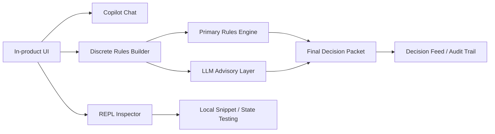
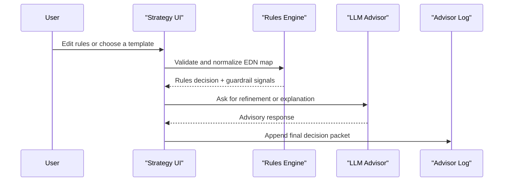

# UI Copilot and Rules Builder

## Purpose

The in-product copilot and discrete strategy builder are designed to help with analysis, drafting, review, and rules construction without pretending to execute trades or mutate the system directly.

The design principle is simple:

- The UI copilot suggests, explains, and reviews.
- The rules engine decides.
- The REPL inspects and tests.
- Execution remains explicit and bounded by the existing app and backend APIs.

## Surfaces

### Copilot Chat

File: [`src/com/little_trader/ui/chat.cljs`](/Users/victorinacio/4coders/little-trader/src/com/little_trader/ui/chat.cljs)

The chat surface supports four operating modes:

- `Assistant` for general help and explanation
- `Copilot` for suggestion-first drafting
- `Reviewer` for bugs, regressions, and missing tests
- `Architect` for system design and rollout sequencing

It also exposes configurable response shaping:

- `temperature` for tone
- `response format` for output structure
- `voice` for brevity or strictness
- `history limit` for shorter or longer context windows

### Discrete Rules Builder

File: [`src/com/little_trader/ui/trading_strategy_discrete.cljs`](/Users/victorinacio/4coders/little-trader/src/com/little_trader/ui/trading_strategy_discrete.cljs)

The discrete strategy page is a two-tier counselor:

- The rules engine is primary.
- The LLM is advisory.
- Suggestions are treated as suggestions unless the user explicitly applies them.

The page includes:

- Editable EDN ruleset
- Conservative, balanced, and opportunistic templates
- Validation warnings and safety checklist
- External data snapshot loader
- LLM copilot for rule refinement
- REPL sandbox for inspection
- Scenario backtesting

## Guardrails

### Suggestion-Only Boundary

The copilot should never imply direct execution from chat.

The UI and prompt behavior should keep this boundary visible:

- “Suggestion-only by design”
- “Draft a patch plan”
- “Review findings”
- “Do not invent APIs”
- “Call out risk and rollback steps”

### Rules Engine Boundary

The rules builder is not a free-form prompt playground.

It should stay within:

- bounded risk percentage
- bounded leverage
- bounded trade size
- bounded DTE window
- bounded open positions
- bounded LLM influence

If a rule crosses a safety boundary, the UI should surface it as a warning rather than hiding it.

### REPL Boundary

The in-app REPL is for inspection and testing.

It should be treated as:

- a verification tool
- a debugging tool
- a snippet evaluator

It should not be treated as a production bypass.

## Template Workflow

The rules builder ships with three starting points:

- `Safe baseline`
- `Balanced`
- `Opportunistic`

These are meant to reduce blank-page editing and make the safety posture obvious before tuning.

Recommended workflow:

1. Load a template.
2. Apply it.
3. Review warnings and safety checklist.
4. Ask the copilot to refine the ruleset.
5. Re-apply.
6. Run a cycle.
7. Inspect the final decision and backtest.

## Prompt Patterns

Useful prompt patterns for the chat copilot:

- Explain the current ruleset.
- Review this route or component for bugs.
- Draft a patch plan for the smallest safe change.
- Generate edge-case tests.
- Explain the final decision and its alignment.
- Propose a safer conservative baseline.

The copilot should answer in a form that is easy to act on:

- concise when asked
- detailed when asked
- structured when asked for a patch plan
- critical when asked for a review

## Architecture

## Decision Flow

## Configuration Notes

### Chat

The chat panel intentionally keeps its behavior configurable in the client:

- mode selection
- response formatting
- temperature
- voice
- history length

### Rules Builder

The rules builder supports:

- partial EDN edits
- template resets
- validation warnings
- safety checklist rendering
- explicit LLM-veto semantics

This makes the workflow flexible without making it ambiguous.

## Known Limits

- The copilot does not execute actions.
- The rules engine still relies on the user to apply changes.
- The LLM can be wrong, so it is advisory only.
- Backtests here are scenario-oriented and should not be confused with production execution.

## Related Docs

- [`docs/COURSE_CURRICULUM.md`](/Users/victorinacio/4coders/little-trader/docs/COURSE_CURRICULUM.md)
- [`docs/C4_ARCHITECTURE.md`](/Users/victorinacio/4coders/little-trader/docs/C4_ARCHITECTURE.md)
- [`docs/LUPII_MVP_SCOPE.md`](/Users/victorinacio/4coders/little-trader/docs/LUPII_MVP_SCOPE.md)

